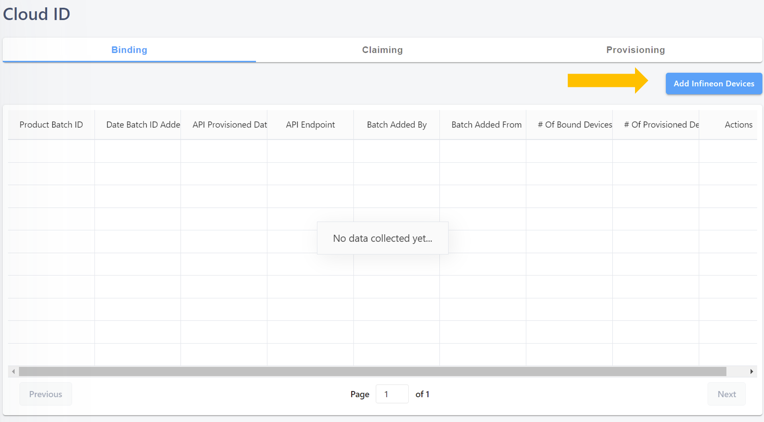
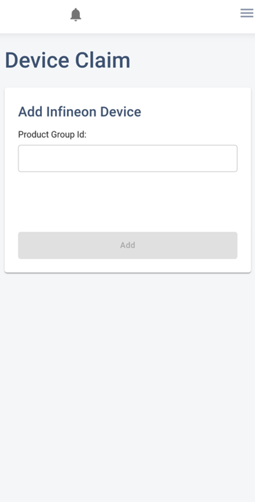
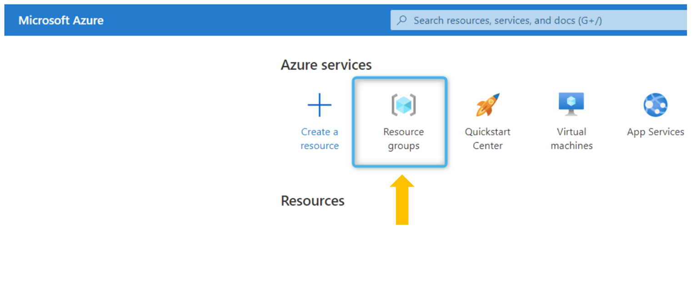
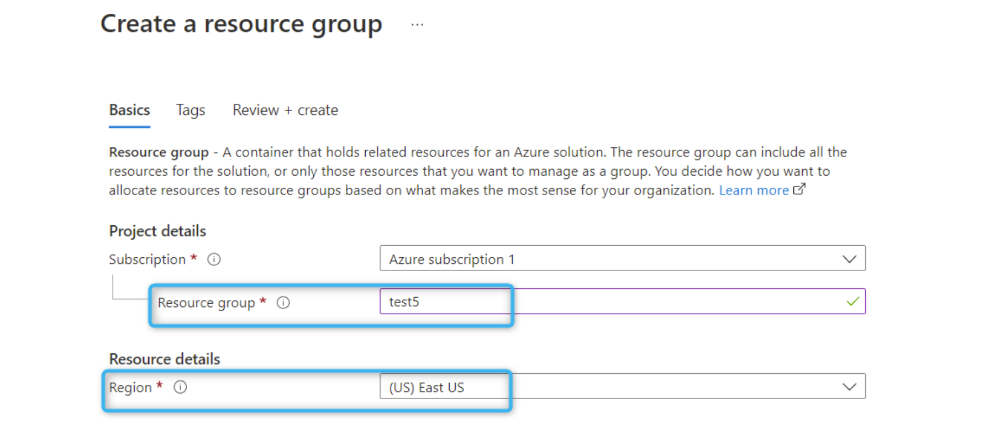
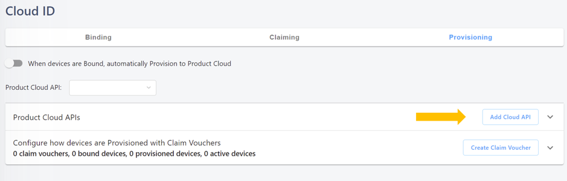
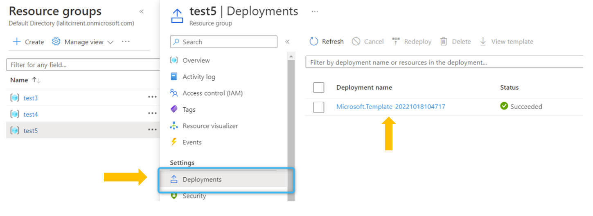
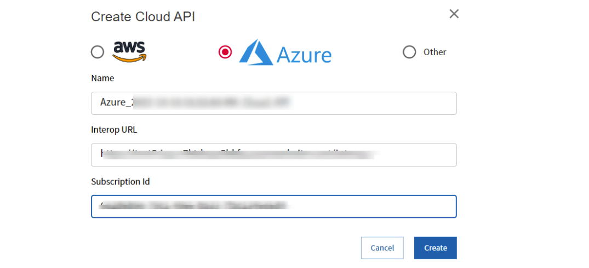
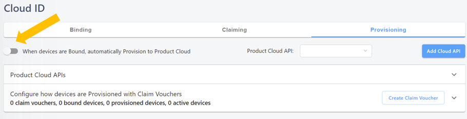

Provisioning devices with Cloud ID
===================================

CIRRENT™ Cloud ID ensures that only authorized devices get access to your Product Cloud. It does so by facilitating a secure device provisioning process. The exact steps involved in the provisioning process depend on your product workflow. However, broadly speaking, the onboarding process involves two key stages:

**Stage One: Binding devices to your Cloud ID account**

You inform CIRRENT™ Cloud ID that a device or batch of devices should be granted access to your Product Cloud. Cloud ID authenticates the devices, ensuring that only authorized devices are permitted to enter your Product Cloud.

**Stage Two: Provisioning devices into your Product Cloud**

CIRRENT™ Cloud ID uses an API to communicate to your Product Cloud that a device or batch of devices have been authenticated and that your Product Cloud should allow communications with these devices. If you do not want to or cannot set up an API link to your Product Cloud you can, as an alternative, manually download the device certificates and inject these into your Product Cloud.

We will now separately look at the two routes – provisioning via Manifest File, and provisioning via API.

Provisioning devices via a Manifest File
*****************************************

You have the option to manually onboard devices by obtaining a Manifest File containing certificates from CIRRENT™ Cloud ID and uploading the Manifest File to your Product Cloud. A Manifest File is a list of Device Certificates that can be used to manually provision devices into the Product Cloud.  This use case is currently implemented in Cloud ID through downloading a CSV file and subsequently uploading the CSV file into your Product Cloud.  

The workflow is as follows: 

1.	Device ships with a built-in Device Certificate prepopulated in CIRRENT™ Cloud ID service.
2.	Use any smartphone to scan the QR Code on the reel and bind ownership.
3.	Log onto the CIRRENT™ Console and download the Manifest File.
4.	Upload the Manifest File into the Product Cloud.
5.	Chain of Trust is established between the Product and the Product Cloud.  All ongoing communications are directly between device and Product Cloud.

 
.. figure:: ../img/pd-1.png

	Provisioning devices using a Manifest File

We will now outline the steps you need to take to complete the above workflow. There are two stages to this process. First, you need to bind ownership of the devices, adding the devices to your CIRRENT™ Cloud ID account. Next, you need to download the Manifest File containing the device certificates and upload these certificates into your API.

.. note:: The steps below outline a manual onboarding process, your devices will not automatically be provisioned to your Product Cloud.

Binding devices
^^^^^^^^^^^^^^^^

Your Cloud ID-compatible devices come pre-installed with a device certificate, but you first need to “bind” the devices to claim these as your own. To bind ownership with these devices you need to add the devices to CIRRENT™ Cloud ID by entering the Product Batch ID for the batch of devices into the Cloud ID section in the CIRRENT™ Console.

Binding using a desktop browser
"""""""""""""""""""""""""""""""""
If you’re using a desktop browser you can bind devices by navigating to **Device Management** and to **Cloud ID**. The default Cloud ID panel displays the batches of devices you have already onboarded. To add a new batch of devices, click on the **Bind an Infineon Product Batch** button.

 

Next, you’ll see the following screen:

.. image:: ../img/pd-3.png
    :align: center
    :alt: Dashboard 2
 

In the Product Batch ID field you enter the BID associated with the devices you want to bind ownership to. This could be a batch of chips, for example, identified by a unique alpha-numeric string.

.. note:: You can use one of the dummy reels to test functionality.

You can enter the BID manually, by copying and pasting the BID, or by using for QR code scanner on a mobile phone. Since you will be downloading the Manifest File to manually upload it to your Product Cloud you need to leave the Product Cloud API field blank. Simply click **Add** to complete the binding process. You should now see the batch of devices listed in your list of bound devices:

.. image:: ../img/pdn-2.png
    :align: center
    :alt: Dashboard 2
 

You will see a counter reflecting the number of bound devices, indicating the number of devices contained in that Product Batch ID.

Binding using a mobile browser
"""""""""""""""""""""""""""""""

CIRRENT™ Cloud ID offers a simplified mobile experience to speed up device provisioning in certain use cases – the factory floor, for example. To start the process of binding devices using a mobile device, simply navigate to the CIRRENT™ Cloud ID section in the CIRRENT™ Cloud. This will automatically display the following prompt:

 
To bind ownership, simply enter the Product Batch ID number. Click **Add** to complete the binding process.

.. note:: To ensure a simplified onboarding experience the Cloud ID mobile browsing experience is restricted and users can only bind devices using a mobile device. Please switch to a desktop device for further device management features, as well as API management features.

.. note:: If you are an administrator-level user you will also be presented with the option to choose a Product Cloud API when binding devices. If you are downloading the Manifest File to manually upload it to your Product Cloud you need to leave the Product Cloud API field blank.

Binding using a mobile device and QR code
""""""""""""""""""""""""""""""""""""""""""

Some Cloud ID-compatible devices will come in a container carrying a QR code. Cloud ID offers a one-step onboarding process for devices shipped with a QR code.
To bind devices that are identified with a QR code, simply scan the QR code with a QR-capable app. The QR code contains a link that automatically directs you to the Cloud ID website, and which also automatically populates the Product Batch ID field. 

.. image:: ../img/pdn-4.png
    :align: center
    :alt: Dashboard 2
 
 Simply click **Add** to confirm the binding step.

Downloading the Manifest File in CIRRENT™ Console
^^^^^^^^^^^^^^^^^^^^^^^^^^^^^^^^^^^^^^^^^^^^^^^^^^

Now that you have completed the binding step in CIRRENT™ Cloud ID you can proceed to download the Manifest File containing the device certificates. To do so, click on the download button next to the entry for the list of devices you’d like to provision into your Product Cloud:

.. image:: ../img/pd-7.png
    :width: 50
    :align: center
    :alt: Dashboard 2
 
Clicking the download button will automatically trigger the download of an .csv file. This csv file contains three data fields:

* **device_id:** containing the unique device ID for an individual device
* **group_id:** the Product Batch ID the device is associated with
* **certificate:** the full device security certificate

As a final step, you need to ingest the .csv Manifest File into your Product Cloud by using an import tool appropriate for your environment.

.. note:: Only users with an administrator role can download Manifest Files.

Provisioning devices via a Product Cloud API
*********************************************

In the previous section, we described how you can use a Manifest File to extract device certificates, which you then manually imported into your Product Cloud to complete onboarding.

In this section, we outline how you can use an API that connects to your Product Cloud - including AWS, Azure, or your custom cloud – to inject device certificates into your Product Cloud when you bind a batch of devices to your Cloud ID account. Broadly speaking, the workflow is as follows:

1.  Device ships with built-in Device Certificate prepopulated in CIRRENT™ Cloud ID service.
2.  You log in to the CIRRENT™ Console and configure the automation to provision your reels into the Product Cloud.
3.  Use any smartphone to scan the QR Code on the reel and bind ownership.
4.  CIRRENT™ Cloud ID service pushes the certificates into Product Cloud through a cloud-to-cloud API.
5.  Chain of trust is established between the device and the Product Cloud.  All ongoing communications are directly between the device and the Product Cloud.

.. figure:: ../img/pca-1.png

You have two options to inject device certificates into your Product Cloud:

* **Automatic.** Choose a default cloud API to automatically accept device certificates as soon as you bind a Batch ID to your account. Cloud ID will automatically provision devices into your cloud API as soon as you activate a Product Batch ID.

* **Manual.** Once you’ve activated a Product Batch ID you can instead choose to manually provision batches of devices to a Product Cloud using a cloud API of your choice. You can also trigger the provisioning action multiple times to provision batches of devices into multiple Product Clouds.

Your unique manufacturing workflow will determine whether automated or manual API-driven provisioning is your best choice.

Configuring a Product Cloud API link
^^^^^^^^^^^^^^^^^^^^^^^^^^^^^^^^^^^^^^

Before you can onboard devices using your Product Cloud API you first need to take steps to configure both your Product Cloud and CIRRENT™ Cloud ID so that two-way communication is possible between your Product Cloud and CIRRENT™ Cloud ID.

It is a two-stage process. First, you need to configure your Product Cloud, obtaining key details that you need to include when you complete the second stage – adding your Product Cloud API details to CIRRENT™ Cloud ID.

Configuring your Product Cloud to accept CIRRENT™ communications
"""""""""""""""""""""""""""""""""""""""""""""""""""""""""""""""""

The steps you need to take to configure your Product Cloud to communicate with CIRRENT™ Cloud ID will vary depending on your choice of cloud environment. CIRRENT™ Cloud ID supports a broad range of cloud environments, including Amazon AWS, Microsoft Azure, and others.

Broadly speaking, you need to take the following steps to ensure that your Product Cloud can communicate seamlessly with CIRRENT™ Cloud ID:

* | Set up the needed resources in your Product Cloud including computing instances and databases

* | Configure the necessary users and associated permissions to enable two-way communications
  |

For some Product Cloud configurations it is possible to automate the above steps. If you are using AWS, you can make use of the AWS CloudFormation template to do that. CIRRENT™ Cloud ID also offers automated provisionign for Azure IoT Hub.  We describe the steps for using the AWS Cloud Formation template and Azure IoT Hub in the next sections.

Setting up the AWS CloudFormation template
~~~~~~~~~~~~~~~~~~~~~~~~~~~~~~~~~~~~~~~~~~~

CloudFormation is an AWS service that helps in setting up the required resources in AWS through a template. Executing a CloudFormation template creates a stack in your AWS account. A stack is a collection of AWS resources.

A sample template for creating AWS resources required for connecting your CCM devices to the AWS IoT Core is already created by INFINEON and stored in Amazon S3 storage. The stack created by this template provides some outputs that can be used to establish cloud to cloud communication between your CIRRENT™ Cloud ID account and your AWS Product Cloud. 

You may want to review the CloudFormation Best Practices and Security section in the AWS documentation. You need to execute the CloudFormation template only once per AWS account in a region. Do the following to execute the INFINEON-provided CloudFormation template:

1. Click on the following link to execute the CloudFormation template. By default, the link uses the **us-west-1** region: 

    `https://us-west-1.console.aws.amazon.com/cloudformation/home?region=us-west-1#/stacks/create/template?stackName=infineon-iot-quickstart&templateURL=https://cirrent-quickstarts.s3.us-west-2.amazonaws.com/infineon-iot-quickstart.yaml  <https://us-west-1.console.aws.amazon.com/cloudformation/home?region=us-west-1#/stacks/create/template?stackName=infineon-iot-quickstart&templateURL=https://cirrent-quickstarts.s3.us-west-2.amazonaws.com/infineon-iot-quickstart.yaml>`_
 
    You can change the region in which you want to execute this template by changing the region=us-west-1 in this link to your required region. See `Choosing a Region <https://docs.aws.amazon.com/awsconsolehelpdocs/latest/gsg/select-region.html>`_ in the AWS documentation.

2. You should now be on the **Create Stack** page in the AWS CloudFormation service, and the Infineon CloudFormation template should be preloaded. Click **Next**.
   
   .. image:: ../img/pca-2.png
        :align: center
        :alt: Dashboard 2

3. On the Step 2 page, retain all parameters at their default values, and click **Next**.

4. On the Step 3 page, retain all parameters at their default values, and click **Next**.

5. Select all the boxes as shown below to provide permissions to access the resources required by the CloudFormation template.

   .. image:: ../img/pca-3.png
        :align: center
        :alt: Dashboard 2
 
6. Click **Create stack**.

7. Wait for up to five minutes for the stack creation to complete.

   .. image:: ../img/pca-4.png
        :align: center
        :alt: Dashboard 2
 
   This stack creates the AWS infrastructure that enables provisioning the required AWS Product Cloud resources when your CCM-equipped product authenticates itself via CIRRENT™ Cloud ID.

8. Click **Outputs**.
   
   The output of the stack that you created is shown on this page. Note the details as you will be required to enter it in the next section when you create a Product Cloud API endpoint in CIRRENT™ Cloud ID. 

   .. image:: ../img/pca-5.png
        :align: center
        :alt: Dashboard 2
 

Setting up the Azure Resource Group for Azure IoT Hub
~~~~~~~~~~~~~~~~~~~~~~~~~~~~~~~~~~~~~~~~~~~~~~~~~~~~~~

To set up an Azure Resource Group you need to complete the following steps.

1. Log into Azure Portal using your Azure credentials. 

2. Click on **Resource Groups**.

3. Click **Create** to create a new Resource Group 

.. image:: ../img/azr_img02.png
        :align: center
        :alt: Setting up Azure IoT Hub for CloudID

4. Enter a name that that is less than 11 characters long. 

.. note:: The 11 character limit is due to a limitation in Azure Resource Groups. Azure requires the name of the group to be between 7 and 24 characters. As part of the creation process, Azure appends a 13 character long string to the name you select. This means you need to keep the name of the group to less than 11 characters. 

5. Select region **US East**, as shown below.

**Prepare Azure Resource Group**

You set up the Resource Group, using a script provided in the CIRRENT public Github repository. The script is a sample that can be used as-is, but you can also modify the script based on your needs. To use the script, ensure that you are logged into Azure in your browser. 

1. In the same browser, click on this link: https://github.com/Cirrent/iot_azure_quickstart

The link takes you to the CIRRENT Github repository. In the README file in the repository you will see a **Deploy to Azure** button that you can click to execute the sample template:

2. Click on the **Deploy to Azure** button to continue. Assuming that you are logged in to Azure, the link will open a browser tab to an Azure URL where you can see the script execute and create the necessary resources in your account. The window will prompt you when provisioning is complete.

.. image:: ../img/azr_img05.png
        :align: center
        :alt: Setting up Azure IoT Hub for CloudID

Adding your Product Cloud API to CIRRENT™ Console
"""""""""""""""""""""""""""""""""""""""""""""""""""""""""""""""""

To configure your first cloud API with Cloud ID, navigate to Device Management and Cloud ID. Select the Provisioning tab, and click on Add Cloud API. 

You’ll be presented with a dialog box where you need to complete your Product Cloud API details.

Configuring Amazon Web Services
~~~~~~~~~~~~~~~~~~~~~~~~~~~~~~~~

Cloud ID has specific steps for Cloud ID users that rely on Amazon Web Services for their Product Cloud. In setting up your Product Cloud API, ensure that you select AWS in the Create Cloud API dialog box:

.. image:: ../img/pca-7.png
        :align: center
        :alt: Dashboard 2

Next, configure the fields as follows:

* **Account ID.** This is your Amazon Web Services account identifier.
* **API Gateway ID.** Here, enter the API gateway ID you have set up.
* **Region.** Select the AWS region your AWS service operates in.
* **Stage.** Provide the name of the stage in your deployment that you want to use for this API link.

You have now added your AWS-based Product Cloud to CIRRENT™ Cloud ID and can now provision devices bound to your Cloud ID account directly into your Product Cloud.

Configuring Azure IoT Hub
~~~~~~~~~~~~~~~~~~~~~~~~~~~~~~~~

Cloud ID has specific steps for Cloud ID users that rely on Azure for their Product Cloud. In order to set up the API connection in Cloud ID, you will need the **interop URL** and the **subscription ID** for the Azure resources. You can find these in the Azure console by doing the following:

1. Click on the **Resource Group** you created using the Cloud ID template and select the **Deployments section**
2. Click on the template name:

3. Click on **Outputs** in the left menu:

.. image:: ../img/azr_img07.png
        :align: center
        :alt: Setting up Azure IoT Hub for CloudID

4. The interop URL (**interopURL**) and subscription ID (**subscriptionID**) will be displayed on the screen. Make a note of both as you'll need it to configure the Azure cloud API in CIRRENT Cloud ID. 

5. Next, in the Product Cloud API section of Cloud ID, ensure that you select Azure as your Product Cloud:

6. Continue to complete the following fields:

* **Name** This is the name of your Azure cloud API.
* **Interop URL.** Here, enter the information in the **interopURL** field in the Azure Console.
* **Subscription ID.** Here, enter the information in the **subscriptionID** field in the Azure Console.

7. Click **Create** to complete the configuration process.

Configuring other cloud APIs
~~~~~~~~~~~~~~~~~~~~~~~~~~~~~~~

First, select the **Other** option to start configuring your Cloud API, as below:

.. image:: ../img/pca-8.png
        :align: center
        :alt: Dashboard 2

You can now proceed to complete the necessary fields.

* **Name:** This is the name of your Product Cloud that will appear in CIRRENT™ Cloud ID. This name will help you identify which Product Cloud you are provisioning a device into when you set up automated provisioning – or when you manually provision a device.

* **Type:** To speed up configuration, choose the relevant cloud service you are configuring – including Azure, AWS or your private cloud.

* **Credentials:** The username and password combination that you have set up to allow CIRRENT™ Cloud ID to communicate with your product cloud. Simply enter the combination as username:password, for example: johndoe:abcxyz123

* **URL:** This is the web address of your Product Cloud.
You have now added your Product Cloud to CIRRENT™ Cloud ID and can now provision devices bound to your Cloud ID account directly into your Product Cloud.

Binding and provisioning devices
^^^^^^^^^^^^^^^^^^^^^^^^^^^^^^^^^

Once you’ve configured your Product Cloud within Cloud ID you can now proceed to provision devices. First, you need to bind ownership of the devices with CIRRENT™ Cloud ID. Your Cloud ID-compatible devices come pre-installed with a device certificate. To bind ownership with these devices you need to add the devices to CIRRENT™ Cloud ID by entering the Product Batch ID for the batch of devices into the Cloud ID section in the CIRRENT™ Console.

Binding and provisioning using a desktop browser
"""""""""""""""""""""""""""""""""""""""""""""""""

To bind and provision devices using a desktop browser, navigate to **Device Management** and to **Cloud ID**. The default Cloud ID panel displays the batches of devices you have already onboarded. To add a new batch of devices click on the **Add Infineon Devices** button.

 

Next, you’ll see the following screen:

.. image:: ../img/pd-11.png
    :align: center
    :alt: Dashboard 2
 

In the Product Batch ID field you enter the BID associated with the devices you want to bind ownership to. This could be a batch of chips, for example. 

.. note:: You can use one of the dummy reels to test functionality.

You can enter the BID manually, by copying and pasting the BID, or by using a QR code scanner. Next, you need to specify the Product Cloud API into which you would like to provision the devices. Simply click **Add** to complete the provisioning process. You should now see the batch of devices listed in your list of Infineon devices:

.. image:: ../img/pdn-6.png
    :align: center
    :alt: Dashboard 2

You will see a counter reflecting the number of bound devices and the number of provisioned devices, indicating the number of devices contained in that Product Batch ID.

Binding and provisioning using a mobile browser
""""""""""""""""""""""""""""""""""""""""""""""""

CIRRENT™ Cloud ID offers a simplified mobile experience to speed up device provisioning in certain use cases – the factory floor, for example. To start the process of binding devices using a mobile device, simply navigate to the CIRRENT™ Cloud ID section in the CIRRENT™ Cloud. This will automatically display the following prompt:

 
To bind ownership, simply enter the Product Batch ID number and choose the Product Cloud API you’d like to use to bind the devices. Click Add to complete the process.

.. note:: To ensure a simplified mobile device registration experience the Cloud ID mobile browsing experience is restricted and users can only bind devices using a mobile device. Please switch to a desktop device for further device management features, as well as API management features.

.. note:: If you are an administrator-level user you will also be presented with the option to choose a Product Cloud API when binding devices. If you are downloading the Manifest File to manually upload it to your Product Cloud you need to leave the Product Cloud API field blank

Binding and provisioning using a mobile device and QR code
""""""""""""""""""""""""""""""""""""""""""""""""""""""""""""

Some Cloud ID compatible devices will come in a container carrying a QR code. Cloud ID offers a one-step onboarding process for devices shipped with a QR code. To bind devices that are identified with a QR code, simply scan the QR code with a QR-capable app. The QR code contains a link that automatically directs you to the Cloud ID website, and which also automatically populates the Product Batch ID field:

Simply select the **Product Cloud API** you would like to receive the device certificates and click **Add** to confirm the binding and provisioning step.

Setting up a default cloud API to automatically receive device certificates
^^^^^^^^^^^^^^^^^^^^^^^^^^^^^^^^^^^^^^^^^^^^^^^^^^^^^^^^^^^^^^^^^^^^^^^^^^^^^

For many manufacturing workflows the best way to provision devices is by automatically injecting the device certificates for authorized devices into your Product Cloud. 
By default, you need to manually provision devices. You can, however, set up an automated workflow to ensure that any devices bound in Cloud ID are automatically provisioned into your Product Cloud. First, you need to enable the Automatically Provision Devices to Product Cloud feature. 

To do so, navigate to Device Management and to Cloud ID. Select the **Provisioning** tab. Look for the **When devices are Bound, automatically Provision to Product Cloud** toggle, which you need to switch to ON:

Next, ensure that you select the cloud API you want to use for automated provisioning. You do so by selecting from this drop-down box:
 
.. image:: ../img/pd-16.png
    :align: center
    :alt: Dashboard 2

Triggering a distinct API provisioning step
^^^^^^^^^^^^^^^^^^^^^^^^^^^^^^^^^^^^^^^^^^^^

You have the option to inject device certificates for a batch of devices into your Product Cloud of choice by triggering a specific API provisioning step. You can trigger this step as many times as needed in order to provision devices into as many Product Clouds as required.

To do so, navigate to **Device Management** and to **Cloud ID**. Select the **Binding** tab. Next, click the provisioning button 

.. image:: ../img/pd-17.png
    :width: 50
    :align: center
    :alt: Dashboard 2

to open the provisioning dialog box. Click **Provision Now** to confirm the provisioning step.

.. image:: ../img/pd-18.png
    :align: center
    :alt: Dashboard 2

Changing the Product Cloud API endpoint for a batch of devices
^^^^^^^^^^^^^^^^^^^^^^^^^^^^^^^^^^^^^^^^^^^^^^^^^^^^^^^^^^^^^^

You change the Product Cloud API endpoint for a batch of devices. You may want to do so if a batch you already bound to your account was never assigned to a Product Cloud API, or if you simply want to change the Product Cloud API endpoint for that group of devices.

To do so, navigate to **Device Management** and to **Cloud ID**. Select the **Binding** tab. Next, click the edit button:

This will activate a drop-down box where you can select the API endpoint:

.. image:: ../img/cpc-1.png
    :align: center
    :alt: Dashboard 2

.. note:: Changing the Product Cloud API endpoint does not automatically trigger device provisioning into your Product Cloud. If you want to provision devices into the newly selected Product Cloud API endpoint you need to trigger a provisioning step by clicking on the provisioning button in the row for that device batch.
