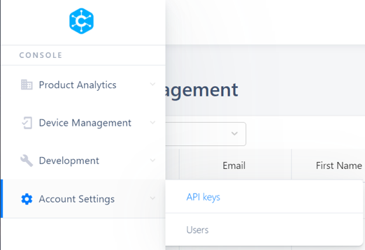

CIRRENT™ Console
=================

The CIRRENT™ Console is the web application that you use to interact with the full range of CIRRENT™ services. You can access the CIRRENT™ Console here: https://cirrent.infineon.com.

CIRRENT™ Console Sections
--------------------------

The CIRRENT™ Console is organized into four sections. Your CIRRENT™ account status determines which CIRRENT™ Console sections you can access, depending on the CIRRENT™ products and services you subscribe to.

* **Product analytics** including sections covering the analytics and investigative tools included in CIRRENT™ Product Analytics, including CIRRENT™ INI and CIRRENT™ MAI. Sections included under the Product Analytics tab include Device Fleet, Device Inspector, App Inspector, Customer Support, Dashboard Manager and Data Exports.

* **Device management** enables you to manage the devices enrolled in the CIRRENT™ Cloud. Use this section to manage device enrollment and authentication. Under this section you can access CIRRENT™ Cloud ID and you can also view a full list of Active Devices.

* **Development** includes two developer tools – the Log Explorer and a Token Validator.

* **Accounting settings** allows you to manage API keys for the CIRRENT™ Mobile App SDK, and contains an area for user management. 

.. note:: The sections that are visible in your CIRRENT™ Console depend on the CIRRENT™ services you subscribe to, and the role your assigned to your user. 

CIRRENT™ Console User Architecture
-----------------------------------

Users
^^^^^^

In the CIRRENT™ Console a user represents an individual person in a company. Every user is defined by a unique email address. Infineon manages users and user authentication with a login at myInfineon. These credentials applies to the CIRRENT™ services, the Infineon community, and other Infineon services.

Accounts
^^^^^^^^^

An account represents a unique collection of devices. A device can only be associated with one account. Each user may be a member of multiple accounts. 
When you log into the CIRRENT™ Console, you’ll be asked to select an account to access, or you may be given the ability to create a new account. 

If you are the person creating a new account you will automatically be the administrator on the new account, and you will be able to add users to the new account as needed.

Roles
^^^^^^^^^

Each user in an account can be assigned one or more roles. The roles available to assign are:

* **Developer role:** allows users to log in to the console and see data for devices on the account

* **Operations role:** allows a user to add Device Types and Devices to an account

* **Administrator role:** includes the ability to create or delete users, create and delete API keys

Managing Users
----------------

You can add new users and modify the details of existing users in the **User Management** section. Simply navigate to **Account Settings** and **Users**.

When you create a new user, make sure to select the correct user role. View the roles section above for more information on specific user roles.

To manage your personal account information, click on the arrow next to your email address. Here you can change your personal details, including your password.
