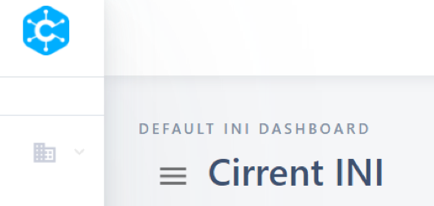
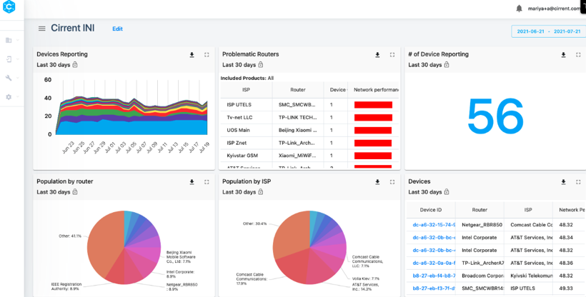
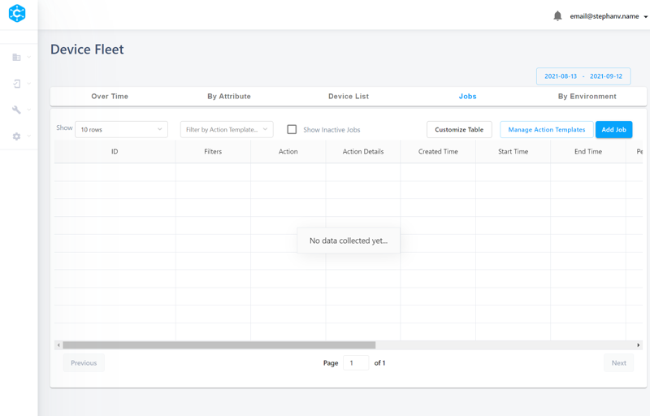
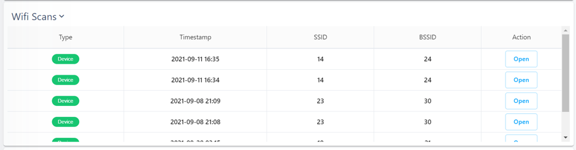
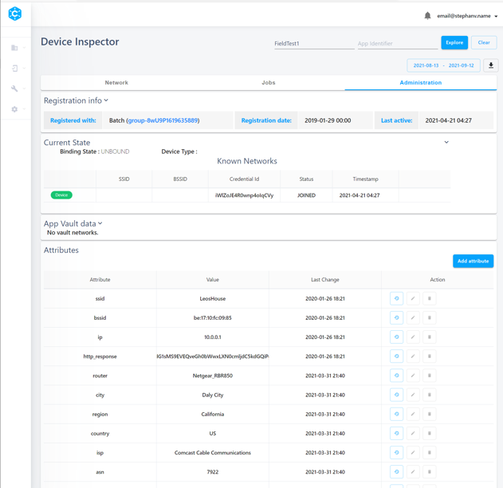

CIRRENT™ Console for INI
=========================

The CIRRENT™ Console for INI is a central dashboard that helps you analyze how your fleet performs in aggregate, troubleshoot issues across your fleet, and to examine the performance and behavior of individual devices. You can read more about the CIRRENT™ Console itself and how to manage it here. 

To use the CIRRENT™ Console for INI you need:

* An active account on the CIRRENT™ Cloud
* A device with CIRRENT™ Agent installed on it
* A device that’s enrolled with CIRRENT™ Cloud

At this point, you’ve set up your device to be able to run CIRRENT™ IoT Network Intelligence (INI), and for you to review your device – or fleet – data 
To get started, just log in to https://cirrent.infineon.com/login with your CIRRENT™ Cloud credentials.

This guide is intended for engineers, product managers and customer support agents who use the console to get insights on their Wi-Fi connected products. This guide will walk you through how you can use the console to monitor performance of your fleet, to get insights at both the aggregate-level and on a single device, and to diagnose problems with products in the field.

**********
Dashboard
**********

The first screen that you will see when you login is your INI dashboard. If you make use of multiple CIRRENT™ products you may need to toggle your dashboard using the hamburger menu, selecting your INI dashboard from the list of choices.

Towards the top of the INI dashboard you can choose the time period that you’d like to examine. Below, you’ll see several tiles containing INI-specific data and charts.

You can read specific values off the charts by doing a mouseover on the data point you’re looking to investigate. 
For a deeper dive into any of the charts, just click on the expansion icon   to view an expanded version of the chart, with each chart offering unique customization options.

Default dashboard panels
^^^^^^^^^^^^^^^^^^^^^^^^^

This is how each panel relates to your IoT fleet:

* **Devices Reporting:** This chart shows number of devices that are reporting each day, across the indicated time period. 

  Expand the chart, and you can customize the chart to view devices reporting by CPU, by router brand or by any custom attribute you submit to the CIRRENT™ Cloud. You can also filter the devices displayed according to your choice of attributes – or filter group.

* **Problematic Routers:** This chart shows on which routers your products are most commonly experiencing the most issues, with ISPs sorted according to our network performance score metric.

  In the expanded chart you can adjust the chart to display results according to a different metric – DNS timeout, or low signal strength for example. You can also apply a filter group, and compare the chart according to a set benchmark.

* **Number of Devices Reporting:** This chart shows number of devices that have reported in the time period. Expand the chart to choose a filter group or add filters one by one to narrow down the counter to a select group of devices.

* **Population by router:** This chart shows the most common routers models your devices are attached to within the time period. Expand the chart to customize the number of slices shown, filter according to a filter group – or add filters one by one. You can also customize the chart to view any one of a range of custom attributes.

* **Population by ISP:** This chart shows a ranking of which Internet Service Providers most of your devices are on during the chosen time period.

* **Event types over time.** A chart that outlines the occurrence of specific event types as these occur over time, including DHCP and DNS issues as well as low signal strength and Wi-Fi interference.

  Expand the chart to customize which attributes are displayed, and to add specific filters or entire filter groups. You can also normalize the data for a standard deviation-based analysis of performance.

* **Recent Events.** This chart shows recent events occurring on any of your devices.

You can customize the CIRRENT™ Console for INI by adding custom charts to your dashboard. Just navigate to **Product Analytics** and **Dashboard Manager** to create new dashboards or to customize an existing dashboard.

.. image:: ../img/img-3.png
    :align: center
    :alt: Dashboard 2

************* 
Device Fleet
*************

The Device Fleet dashboard is where you can get an overview across your entire device fleet. It shows multiple tabs in a single tile, with fives tabs in total, each providing an aggregate view of your fleet. You can also check relative performance across different sub-sets of the fleet.

With this dashboard you have the ability to slice and dice the data by customizing the metrics displayed, choosing a filter group, or by adding individual filters. You can also customize the date range.

It allows you to see the performance of your device fleet including the top issues and errors that are reported by your devices. This data is helpful to help troubleshoot your products and provide the best experience for your users.

Over Time
^^^^^^^^^^^

This tab shows key metrics over a time period. Toggling Normalize Data allows you to see the metric counts. You can filter by metric type (including network performance events and custom events). You can also filter by various attributes. For example, if you only want to look at your devices in the United States, you can filter by Country = US.

.. image:: ../img/img-4.png
    :align: center
    :alt: Dashboard 2
 
In this view, there are over 30+ prebuilt metrics, which can be leveraged to slice and dice the data and to filter for specific views. 
For complete full details on the exact meaning of metrics, and how these metrics are calculated, please view the INI Data Model page. The metrics you have access to include via the INI Console includes:

1.	WiFi Connected
2.	WiFi Disconnected
3.	App Crash
4.	Bssid Switch
5.	Days Since Last Connect
6.	Destination Service Unreachable
7.	Dhcp No Gateway
8.	Dhcp No Ip Address
9.	Dhcp No Netmask
10.	Dns Error
11.	Dns Timeout
12.	Gateway Error
13.	Gateway Internet Error
14.	High Cpu Usage
15.	High Memory Usage
16.	High Per
17.	Ip Conflict
18.	Low Signal Strength
19.	Low Storage
20.	Network Performance
21.	Offline Percentage 30 Days
22.	Offline Percentage 7 Days
23.	Powered On
24.	Restart Triggered
25.	Restarted
26.	Shutdown Triggered
27.	Tls Error
28.	Tls Expired
29.	Tls Hostname Mismatch
30.	Tls Not Yet Valid
31.	Wifi Associating
32.	Wifi Diassociated
33.	Wifi Disconnect
34.	Wifi Disconnected
35.	Wifi Failed Association
36.	Wifi Interference
37.	Wifi Not Associated
38.	Wifi Scan

All of these metrics can also be filtered by the following categories:

1.	City
2.	Country
3.	ASN
4.	CPU
5.	Device Type
6.	ISP
7.	OS
8.	Postal Code
9.	Region
10.	Router
11.	Router Brand
12.	Router Brand Model
13.	Wi-Fi Radio
14.	Wi-Fi Radio Driver

By Attribute
^^^^^^^^^^^^^

This view shows a ranked view of metrics – including device attributes and events. You’re able to select a metric to view and filter by any attribute. You can customize which columns that appear in the attribute view.

.. image:: ../img/img-5.png
    :align: center
    :alt: Dashboard 2
 
Device List
^^^^^^^^^^^^^

This is a list of unique devices that have experienced the selected metric. In the screen below, Low Signal Strength is the metric. You’re also able to filter by any attribute, change the time period and customize the columns. The list defaults to a ranking from highest metric value to lowest.
 
.. image:: ../img/img-6.png
    :align: center
    :alt: Dashboard 2

Jobs
^^^^^

The jobs tab allows you to manage CIRRENT™ Agent jobs across your entire device fleet. You can monitor jobs queued for action, and add jobs for future execution.
 

By Environment
^^^^^^^^^^^^^^^^

This is a benchmarking tool. To get the most out of the dashboard, click the settings button 

.. image:: ../img/icon.png

and choose what metric you’d like to view. Choose environment - from ISP, router, country or a combination of those. Then choose any attribute or attribute combination to compare against any other attribute or combination of attributes.

.. image:: ../img/img-8.png
    :align: center
    :alt: Dashboard 2
  
Once you apply the settings that you have chosen, the benchmark chart will populate. It will default to ranking from worst to best, but you can click on any of the columns and it will rank based on the column. For example, if you want to rank by number of devices in that environment, click “Device Count.”

Device Inspector
^^^^^^^^^^^^^^^^^^^

The Device Inspector dashboards give you the view of a single device thanks to a device-level view. Your team can review the rich data on an individual device level to diagnose any particular issues with a device – or to achieve a deeper understanding of device behavior in the field. 

Device inspector covers data such as:

1.	Last Known State (Channel, Channel Width, Band, etc)
2.	Mesh Info (Single Node, Multiple Nodes, etc)
3.	Metrics Summary (10+ metrics)
4.	Measurements (Signal Strength, Wi-Fi Data Rate, etc)
5.	Wi-Fi Scans
6.	Diagnostics

Network
^^^^^^^^^

This page shows the network performance of a single device. In the top right side, input the device ID and choose the time period to explore.

The **Last Known State** will show environmental information for the device including the network operator and the router make and model that the device is connected to. It will also show the SSID, BSSID, signal strength, frequency and channel width and a number of other data points – including custom data you collect via the CIRRENT™ Agent.

**Metrics Summary** table allows you to compare metrics for this single device against other devices in your fleet or a subset of the other devices in your fleet. Under the Last 30 days average, there is a dropdown menu where you can choose either from a list of attributes including device type, router, region, ISP, and more.

This is useful to understand if this device is performing better, worse or average compared to other like devices or devices in similar environments. For example, perhaps you’d like to compare this device against other devices with the same device type, or connected to the same router brand. This will help you nail down root cause of issues.

**Metrics Over Time** shows metrics for that particular device over the selected time period.
  
.. image:: ../img/img-9.png
    :align: center
    :alt: Dashboard 2

**Metrics** is a detailed breakdown of events for the device across the date range provided. You can customize the breakdown by selecting the events shown, and the date range.
 
**Measurements** shows the measurements collected by the CIRRENT™ Agent for the device.

.. image:: ../img/img-10.png
    :align: center
    :alt: Dashboard 2

**Wi-Fi Scans** shows the list of Wi-Fi networks around the device. This is useful to check if there is an issue related to mesh extenders, or if there are too many networks on a particular Wi-Fi channel.

**Legacy diagnostics** will allow you to run legacy diagnostics on this particular device and view diagnostics that you have run as well as their status and results. Note that the legacy diagnostic feature has been deprecated, diagnostics should now be executed using the Jobs panel.

.. image:: ../img/img-12.png
    :align: center
    :alt: Dashboard 2

Jobs
^^^^^^^

From this tab, you are able to run jobs such as diagnostics on a single device. You will see the status of the job on the chart table. Once the job has run, you will be able to click on the results to see more information.

.. image:: ../img/img-13.png
    :align: center
    :alt: Dashboard 2

Administration
^^^^^^^^^^^^^^^^^

This tab gives you further detailed information about the device. You can see which batch the device has been registered with, its registration date and the last active date.

You can also view a complete list of all attributes recorded for the device, including the last moment in time the attribute changed.

***************************************
Exporting data from the CIRRENT™ Cloud
***************************************

The CIRRENT™ Console allows you to export data from the CIRRENT™ Cloud. 
You start the export process using the

.. image:: ../img/icon-2.png
   
button located next to the chart or table you are viewing. 

Exporting chart data
^^^^^^^^^^^^^^^^^^^^^^^

All charts can be exported as images – either as an Adobe Acrobat PDF or a .PNG file. Alternatively, you can export the chart values displayed in a .CSV file. When you are exporting a chart your export action will trigger an immediate download in your browser.

Exporting tables
^^^^^^^^^^^^^^^^^^^

You export table contents the same way you export chart data, but when you export a table your export will be generated by CIRRENT™ Cloud and made available under the **Data Exports** tab under **Product Analytics**.

.. image:: ../img/img-15.png
    :align: center
    :alt: Dashboard 2
