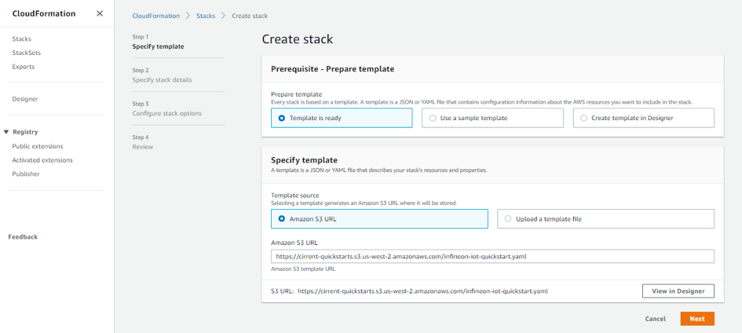
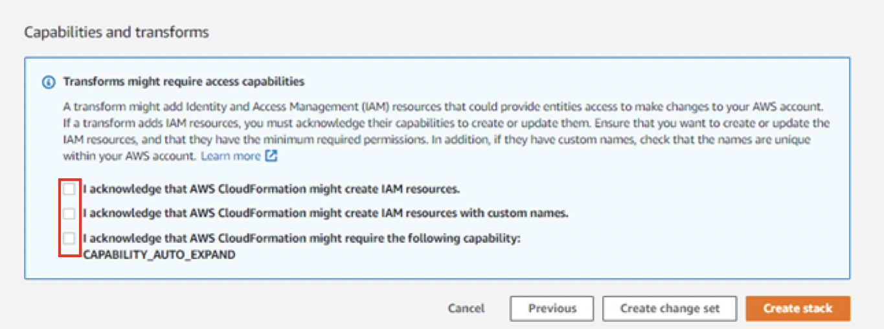
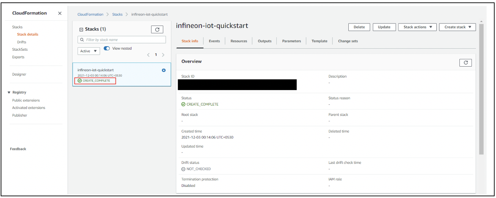
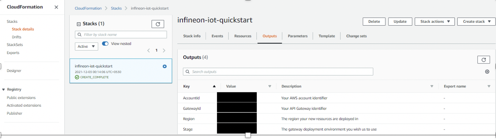

# 1.1.1.1	Configuring AWS IoT for Cloud ID

CloudFormation is an AWS service that helps in setting up the required resources in AWS IoT through a template (JSON or YAML file). Executing a CloudFormation template creates a stack in the AWS CloudFormation service. A stack is a collection of AWS resources.   You can read more about CloudFormation from the  [AWS documentation here https://docs.aws.amazon.com/cloudformation/index.html](https://docs.aws.amazon.com/cloudformation/index.html).  

A sample template for creating AWS resources required for connecting a device like an Eval Kit or a module, like the CCM, to your product cloud on AWS IoT Core has been created by Infineon and stored in Amazon S3 storage. The stack created by this template provides some output that can be used to authenticate & establish a cloud to cloud API between your CIRRENT account and your AWS account. 

You need to execute the CloudFormation template only once per AWS account in a region. The same stack can be reused to provision multiple kits to the AWS account in that region. 

You may want to review the CloudFormation Best Practices and Security section in the AWS documentation.  You will not need to provide Infineon with your AWS credentials if you use dynamic references.     

Do the following to execute the Infineon-provided CloudFormation template:

1.	Click on the following link to execute the CloudFormation template. By default, the link uses the us-west-1 region. 
	[https://us-west-1.console.aws.amazon.com/cloudformation/home?region=us-west-1#/stacks/create/template?stackName=infineon-iot-quickstart&templateURL=https://cirrent-quickstarts.s3.us-west-2.amazonaws.com/infineon-iot-quickstart.yaml](https://us-west-1.console.aws.amazon.com/cloudformation/home?region=us-west-1#/stacks/create/template?stackName=infineon-iot-quickstart&templateURL=https://cirrent-quickstarts.s3.us-west-2.amazonaws.com/infineon-iot-quickstart.yaml)

	You can change the region in which you want to execute this template by changing the region=us-west-1 in this link to your required region. See Choosing a Region (https://docs.aws.amazon.com/awsconsolehelpdocs/latest/gsg/select-region.html) on AWS documentation. 

2.	On the Create Stack page in the AWS CloudFormation service with the Infineon CloudFormation template preloaded, click **Next**. 
	
    
 
3.	On the Step 2 page, retain all parameters at their default values, and click **Next**.

4.	On the Step 3 page, retain all parameters at their default values, and click **Next**.

5.	Select the boxes to provide permissions to access the resources required by the CloudFormation template. 
	
	
 
6.	Click **Create stack**. 

7.	Wait for up to five minutes for the stack creation to complete. 

	
 
	This stack creates an infrastructure to enable provisioning the required resources for the  device you’re connecting into AWS IoT through the CIRRENT Cloud.

8.	Click **Outputs**. 
	Once the stack is created, it will return 4 fields (AccountID, GatewayID, Region & Stage).  You will need these to link your stack in the CIRRENT Console.    

	
 
 
