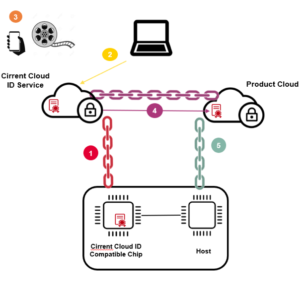
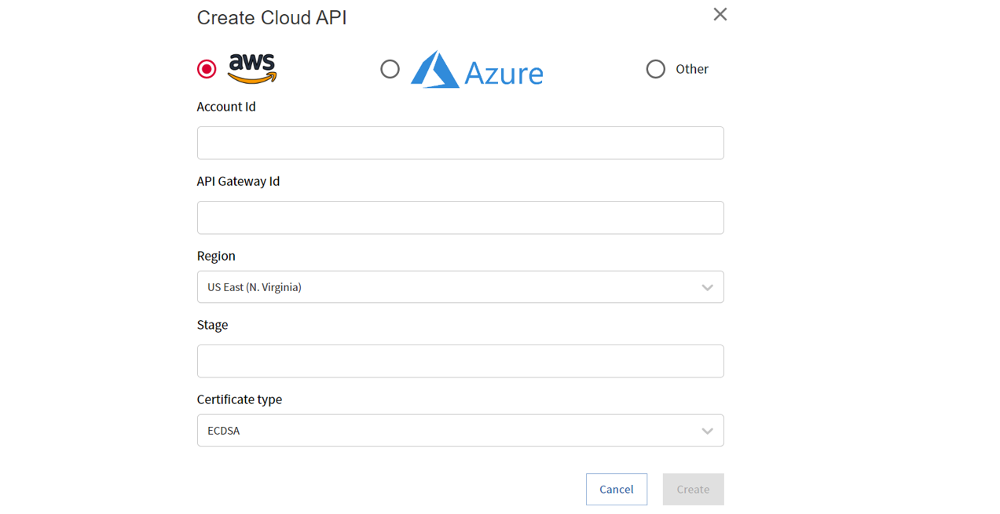
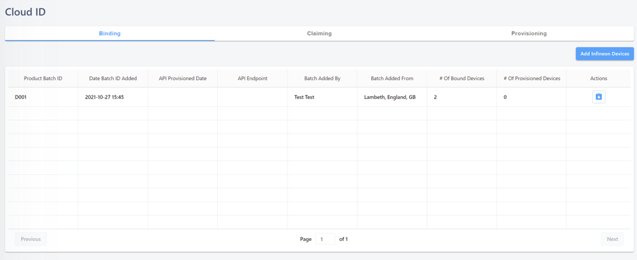

# Provisioning devices via a Product Cloud API

In the previous section, we described how you can use a Manifest File to extract device certificates, which you then manually imported into your Product Cloud to complete onboarding.

In this section, we outline how you can use an API that connects to your Product Cloud - including AWS, Azure, or your custom cloud – to inject device certificates into your Product Cloud when you bind a batch of devices to your Cloud ID account. Broadly speaking, the workflow is as follows:

1.  Device ships with built-in Device Certificate prepopulated in CIRRENT™ Cloud ID service.
2.  You log in to the CIRRENT™ Console and configure the automation to provision your reels into the Product Cloud.
3.  Use any smartphone to scan the QR Code on the reel and bind ownership.
4.  CIRRENT™ Cloud ID service pushes the certificates into Product Cloud through a cloud-to-cloud API.
5.  Chain of trust is established between the device and the Product Cloud.  All ongoing communications are directly between the device and the Product Cloud.

Provisioning devices to your Product Cloud using an API

You have two options to inject device certificates into your Product Cloud:

* **Automatic.** Choose a default cloud API to automatically accept device certificates as soon as you bind a Batch ID to your account. Cloud ID will automatically provision devices into your cloud API as soon as you activate a Product Batch ID.

* **Manual.** Once you’ve activated a Product Batch ID you can instead choose to manually provision batches of devices to a Product Cloud using a cloud API of your choice. You can also trigger the provisioning action multiple times to provision batches of devices into multiple Product Clouds.

Your unique manufacturing workflow will determine whether automated or manual API-driven provisioning is your best choice.

## Configuring a Product Cloud API link

Before you can onboard devices using your Product Cloud API you first need to take steps to configure both your Product Cloud and CIRRENT™ Cloud ID so that two-way communication is possible between your Product Cloud and CIRRENT™ Cloud ID.

It is a two-stage process. First, you need to configure your Product Cloud, obtaining key details that you need to include when you complete the second stage – adding your Product Cloud API details to CIRRENT™ Cloud ID.

### Configuring your Product Cloud to accept CIRRENT™ communications

The steps you need to take to configure your Product Cloud to communicate with CIRRENT™ Cloud ID will vary depending on your choice of cloud environment. CIRRENT™ Cloud ID supports a broad range of cloud environments, including Amazon AWS, Microsoft Azure, and others.

Broadly speaking, you need to take the following steps to ensure that your Product Cloud can communicate seamlessly with CIRRENT™ Cloud ID:

* Set up the needed resources in your Product Cloud including computing instances and databases
* Configure the necessary users and associated permissions to enable two-way communications

For some Product Cloud configurations it is possible to automate the above steps. If you are using AWS, you can make use of the AWS CloudFormation template to do that. We describe the steps for using the AWS Cloud Formation template in the next section.

### Setting up the AWS CloudFormation template

CloudFormation is an AWS service that helps in setting up the required resources in AWS through a template. Executing a CloudFormation template creates a stack in your AWS account. A stack is a collection of AWS resources.

A sample template for creating AWS resources required for connecting your CCM devices to the AWS IoT Core is already created by INFINEON and stored in Amazon S3 storage. The stack created by this template provides some outputs that can be used to establish cloud to cloud communication between your CIRRENT™ Cloud ID account and your AWS Product Cloud. 

You may want to review the CloudFormation Best Practices and Security section in the AWS documentation. You need to execute the CloudFormation template only once per AWS account in a region. Do the following to execute the INFINEON-provided CloudFormation template:

1. Click on the following link to execute the CloudFormation template. By default, the link uses the **us-west-1** region: 

	`https://us-west-1.console.aws.amazon.com/cloudformation/home?region=us-west-1#/stacks/create/template?stackName=infineon-iot-quickstart&templateURL=https://cirrent-quickstarts.s3.uswest-2.amazonaws.com/infineon-iot-quickstart.yaml  <https://us-west-1.console.aws.amazon.com/cloudformation/home?region=us-west-1#/stacks/create/template?stackName=infineon-iot-quickstart&templateURL=https://cirrent-quickstarts.s3.uswest-2.amazonaws.com/infineon-iot-quickstart.yaml>`_
 
	You can change the region in which you want to execute this template by changing the region=us-west-1 in this link to your required region. See `Choosing a Region <https://docs.aws.amazon.com/awsconsolehelpdocs/latest/gsg/select-region.html>`_ in the AWS documentation.

2. You should now be on the **Create Stack** page in the AWS CloudFormation service, and the Infineon CloudFormation template should be preloaded. Click **Next**.
   
   

3. On the Step 2 page, retain all parameters at their default values, and click **Next**.

4. On the Step 3 page, retain all parameters at their default values, and click **Next**.

5. Select all the boxes as shown below to provide permissions to access the resources required by the CloudFormation template.

   
 
6. Click **Create stack**.

7. Wait for up to five minutes for the stack creation to complete.

   
 
   This stack creates the AWS infrastructure that enables provisioning the required AWS Product Cloud resources when your CCM-equipped product authenticates itself via CIRRENT™ Cloud ID.

8. Click **Outputs**.
   
   The output of the stack that you created is shown on this page. Note the details as you will be required to enter it in the next section when you create a Product Cloud API endpoint in CIRRENT™ Cloud ID. 

   
 

### Adding your Product Cloud API to CIRRENT™ Console

To configure your first cloud API with Cloud ID, navigate to Device Management and Cloud ID. Select the Provisioning tab, and click on Add Cloud API. 

You’ll be presented with a dialog box where you need to complete your Product Cloud API details.

### Configuring Amazon Web Services

Cloud ID has specific steps for Cloud ID users that rely on Amazon Web Services for their Product Cloud. In setting up your Product Cloud API, ensure that you select AWS in the Create Cloud API dialog box:

Next, configure the fields as follows:

* **Account ID.** This is your Amazon Web Services account identifier.
* **API Gateway ID.** Here, enter the API gateway ID you have set up.
* **Region.** Select the AWS region your AWS service operates in.
* **Stage.** Provide the name of the stage in your deployment that you want to use for this API link.

You have now added your AWS-based Product Cloud to CIRRENT™ Cloud ID and can now provision devices bound to your Cloud ID account directly into your Product Cloud.

### Configuring other cloud APIs

First, select the Other option to start configuring your Cloud API, as below:

You can now proceed to complete the necessary fields.

* **Name:** This is the name of your Product Cloud that will appear in CIRRENT™ Cloud ID. This name will help you identify which Product Cloud you are provisioning a device into when you set up automated provisioning – or when you manually provision a device.

* **Type:** To speed up configuration, choose the relevant cloud service you are configuring – including Azure, AWS or your private cloud.

* **Credentials:** The username and password combination that you have set up to allow CIRRENT™ Cloud ID to communicate with your product cloud. Simply enter the combination as username:password, for example: johndoe:abcxyz123

* **URL:** This is the web address of your Product Cloud.
You have now added your Product Cloud to CIRRENT™ Cloud ID and can now provision devices bound to your Cloud ID account directly into your Product Cloud.

### Binding and provisioning devices

Once you’ve configured your Product Cloud within Cloud ID you can now proceed to provision devices. First, you need to bind ownership of the devices with CIRRENT™ Cloud ID. Your Cloud ID-compatible devices come pre-installed with a device certificate. To bind ownership with these devices you need to add the devices to CIRRENT™ Cloud ID by entering the Product Batch ID for the batch of devices into the Cloud ID section in the CIRRENT™ Console.

#### Binding and provisioning using a desktop browser

To bind and provision devices using a desktop browser, navigate to **Device Management** and to **Cloud ID**. The default Cloud ID panel displays the batches of devices you have already onboarded. To add a new batch of devices click on the **Add Infineon Devices** button.

Next, you’ll see the following screen:

In the Product Batch ID field you enter the BID associated with the devices you want to bind ownership to. This could be a batch of chips, for example. 

> **_NOTE:_** You can use one of the dummy reels to test functionality.

You can enter the BID manually, by copying and pasting the BID, or by using a QR code scanner. Next, you need to specify the Product Cloud API into which you would like to provision the devices. Simply click **Add** to complete the provisioning process. You should now see the batch of devices listed in your list of Infineon devices:

You will see a counter reflecting the number of bound devices and the number of provisioned devices, indicating the number of devices contained in that Product Batch ID.

#### Binding and provisioning using a mobile browser

CIRRENT™ Cloud ID offers a simplified mobile experience to speed up device provisioning in certain use cases – the factory floor, for example. To start the process of binding devices using a mobile device, simply navigate to the CIRRENT™ Cloud ID section in the CIRRENT™ Cloud. This will automatically display the following prompt:

 
To bind ownership, simply enter the Product Batch ID number and choose the Product Cloud API you’d like to use to bind the devices. Click Add to complete the process.

> **_NOTE:_** To ensure a simplified mobile device registration experience the Cloud ID mobile browsing experience is restricted and users can only bind devices using a mobile device. Please switch to a desktop device for further device management features, as well as API management features.

> **_NOTE:_** If you are an administrator-level user you will also be presented with the option to choose a Product Cloud API when binding devices. If you are downloading the Manifest File to manually upload it to your Product Cloud you need to leave the Product Cloud API field blank

#### Binding and provisioning using a mobile device and QR code

Some Cloud ID compatible devices will come in a container carrying a QR code. Cloud ID offers a one-step onboarding process for devices shipped with a QR code. To bind devices that are identified with a QR code, simply scan the QR code with a QR-capable app. The QR code contains a link that automatically directs you to the Cloud ID website, and which also automatically populates the Product Batch ID field:

Simply select the **Product Cloud API** you would like to receive the device certificates and click **Add** to confirm the binding and provisioning step.

