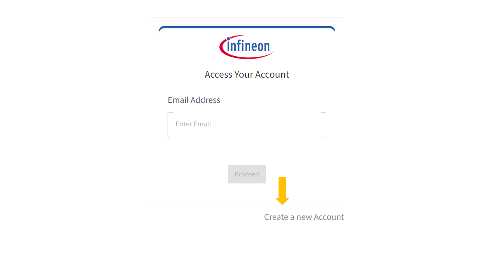
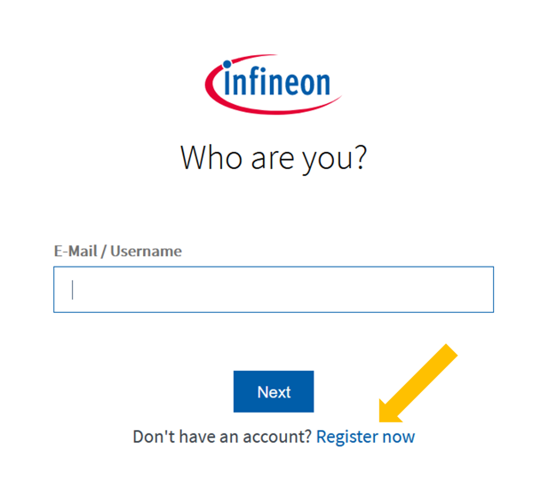
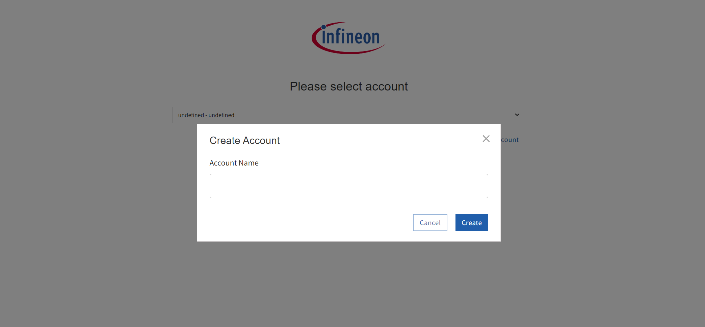
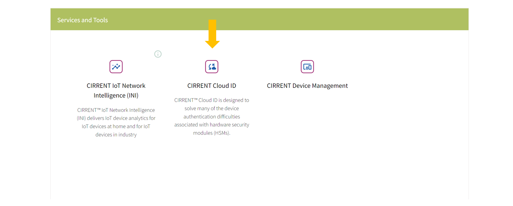
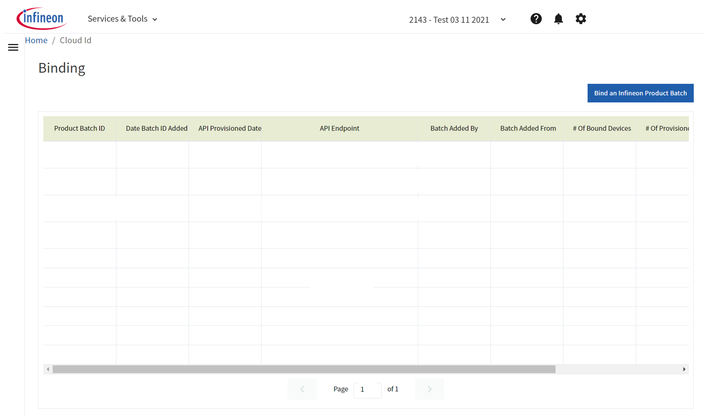
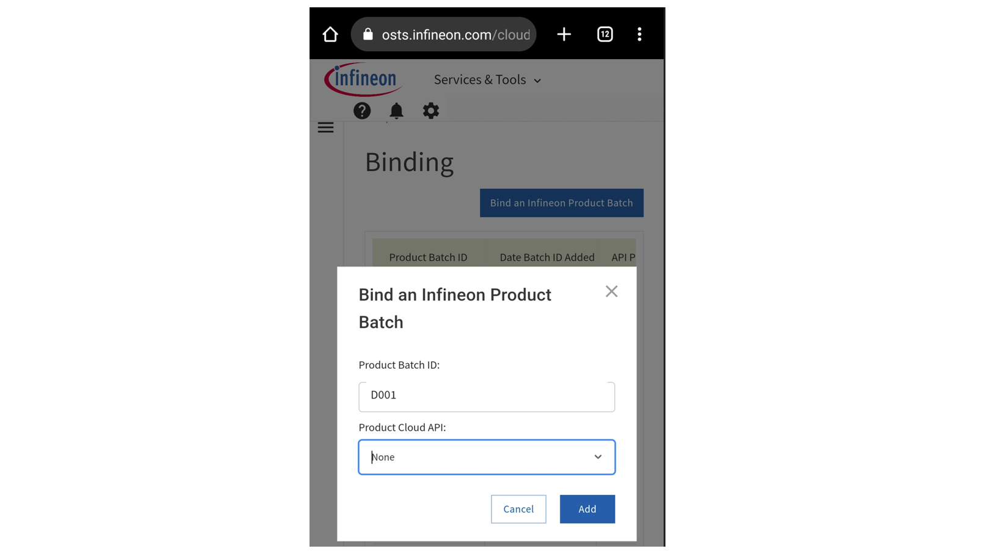
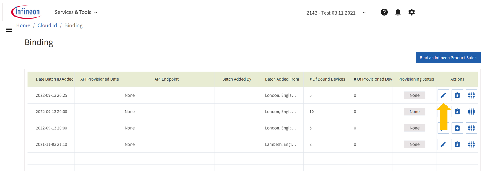
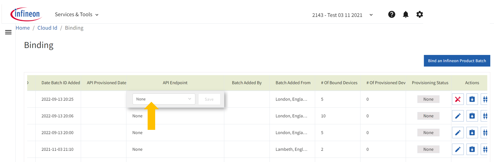
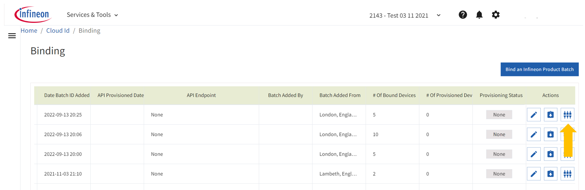
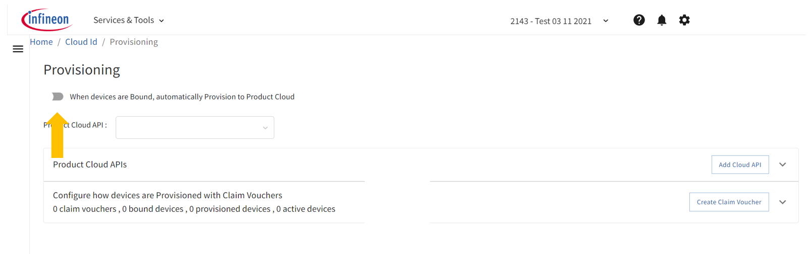

# Quick Start Guide: Cloud ID Virtual Developer Kit

## Objective of this kit

The objective of this developer kit is to provide an initial overview of CIRRENT™ Cloud ID, and to help developers try Cloud ID software capabilities for themselves. The developer kit outlines all the essential steps you need to take to get started with Cloud ID. Once device support for Cloud ID is released, any logins and APIs you’ve configured will be fully transferrable and usable.

> **_NOTE:_** This is only an introductory guide. For full CIRRENT™ Cloud ID documentation, [please visit this URL](https://swdocs.cypress.com/html/cirrent-support-documentation/en/latest/).

## What is Cloud ID?

CIRRENT™ Cloud ID is designed to solve many of the device authentication difficulties associated with hardware security modules (HSMs), while avoiding the security risks of software-only alternatives.

Cloud ID works by extending the silicon-based chain of trust from Product Company devices to the Product Cloud. It does so by acting as a registration intermediary, using hardware-based certificates in compatible chips for authentication, and subsequently confirming the authentication with your Product Cloud.

By using Cloud ID you no longer need to manually handle devices on the manufacturing line to process registration, nor do you risk using insecure software solutions.

**How Cloud ID integrates with your manufacturing process and your Product Cloud**

CIRRENT™ Cloud ID is pre-populated with the device certificates for Cloud ID-compatible chips. During the manufacturing process you install Cloud ID-compatible chips into your devices. When you receive a batch of chips and when these chips are ready for installation, you or your contract manufacturer simply need to scan a QR code to “bind” the devices with your Cloud ID account. 

Cloud ID securely informs your Product Cloud that a batch of devices has been claimed and that these devices should be allowed to communicate with your Product Cloud. The Cloud ID process ensures that only genuine, authorized devices are allowed to communicate with your Product Cloud.

## What do you need for this developer kit?  

* A PC or Mac and a web browser.
* A smartphone with a QR code scanner.  Most modern smartphones these days have a QR code scanner in the camera software, or you can download a QR code app.

## Steps to complete the virtual developer kit

We’ve split this guide into five steps that guide you through setting up CIRRENT™ Cloud ID, illustrating just how easy it is to use Cloud ID in practice.

### 1. Sign up for a Cloud ID account

CIRRENT™ is an Infineon company and CIRRENT™ services, including CIRRENT™ Cloud ID, are delivered through the Infineon OSTS Console. Before you get started testing Cloud ID you first need to create an Infineon user account.

**> Complete these steps using a PC and browser**

A.  Go to https://osts.infineon.com/login and click on **Create a new account**.
    

B.  On the next screen, click **Register Now**.
    

C.  Complete your contact details, and click **Create Account**.

D.  Click **I Agree with Terms of Service**.

E.  Because you have just created an Infineon user you will first need to create a new CIRRENT™ account. Enter an account name in the prompt and click **Create**:
    

F.  Add any team members you’d like to include, and click **Add**, or click **Do it Later** if you don’t want to add team members.

G.  When you’re presented with the Infineon OSTS landing page, click on **CIRRENT™ Cloud ID**. You can also directly access the page with this URL: https://osts.infineon.com/cloud-id.
    

H.  You’ll now see the CIRRENT™ Cloud ID screen, confirming you’re set up to access CIRRENT™ Cloud ID:
    
	

### 2. Try to bind a batch of devices using a QR Code

Cloud-ID compatible devices must first be associated with a Cloud ID account before device certificates are sent to your Product Cloud. Binding is the step you need to take to associate your devices with your Cloud ID account. We offer a convenient one-step binding process using a QR code.

**> Complete these steps using a mobile phone**

A.	Open a QR code-capable camera app on your phone.

B.  Using your camera app or QR code scanner, scan this sample QR code: 
    

    The QR code contains both a URL and a Product Batch ID (BID), in this case BID #D001. Scanning the code automatically sends you to the right URL for the Infineon OSTS Console, directly to the device binding page, pre-populated with the BID.

C.  You will be prompted to log in, you can do so using the credentials you configured in Step 1. On the following screen, ensure your test account is selected, and click **Next**.   

D.  Next, you will see a screen requesting a Product Batch ID. The Product Batch ID should be pre-populated, but if it is not, type the BID of the sample QR code (D001) into the **Product Batch ID** field. For now you can leave **Product Cloud API** set at None. Tap **Add** to complete the process.
    

E.  The system will provide you with an indication of success. 

The above steps show you how simple it is to associate a batch of devices with your CIRRENT™ Cloud ID account.

> **_NOTE:_** If you try and bind a reel for the second time, you will get an error condition saying that you've already binded it.

### 3. Verify that devices are now bound in CIRRENT™ Cloud ID

Now that you’ve completed the binding process you can view the results in the Infineon OSTS Console.

**> Complete these steps using a PC and browser**

A.  Navigate to **CIRRENT™ Cloud ID** in the Infineon OSTS Console. You can also directly access the page with this URL: https://osts.infineon.com/cloud-id

B.  Verify that the devices you bound using a QR code are listed under the Binding section. You’ll notice a device count under **# of Bound Devices**.

PS: Now is also a good time to test downloading the Manifest File. For some use cases, you may prefer to get manual access to device certificates – to manually upload these into your Product Cloud. Click the 

button to download the Manifest File containing device certificates compressed in .7z format.

### 4. Set up a Cloud API and test Product Cloud provisioning

In most scenarios, you will want to provision claimed devices directly into your Product Cloud using an API, instead of downloading and importing a Manifest File. The steps below highlight how you configure a cloud API link and show you how to trigger the provisioning process.

**> Complete these steps using a PC and browser**

A.  From the Infineon OSTS home page navigate to **CIRRENT™ Cloud ID**, and navigate to the **Provisioning** page using the hamburger menu. You can also follow this link: https://osts.infineon.com/cloud-id/provisioning.

B.  Next, click on **Add Cloud API**.

C.  Complete your Cloud API details in the dialogue box, and click **Create**. For the purpose of this developer kit you can enter dummy details just to test the functionality.

D.  Confirm that the API link you’ve just added appears in the **Product Cloud APIs** section of the **Provisioning** page.
    

You’ve now configured an API link to your Product Cloud and you’re ready to test provisioning devices directly into your Product Cloud. This is what you need to do to complete the provisioning step:

A.  From the Infineon OSTS landing page navigate to **CIRRENT™ Cloud ID** and use the hamburger menu to navigate to Binding, or use this link – https://osts.infineon.com/cloud-id/binding/

B. Find the batch of devices you bound in Step 2, and click on the edit button in that row.
    

C.  This will activate the **API Endpoint** editor for that batch of devices. Simply select the API endpoint you created in the previous section and click **Save**.
    

D. Next, you need to trigger the provisioning step. Click the **Provisioning** button, and click **Provision Now**.
    

E.  Verify that the **# of Provisioned Devices** in that row now matches the **# of Bound Devices**.

You’re all done now – you’ve just provisioned devices into your Product Cloud. You should now also be able to view the device certificates when you log into your Product Cloud.

### 5. Test automatic Product Cloud provisioning

CIRRENT™ Cloud ID is designed to be extremely simple to use in practice. In this section we’ll illustrate how scanning a QR code can seamlessly trigger both device binding and device provisioning in a single step. For example, an authorized representative on the factory floor can simply scan the QR code of a batch of Cloud ID-compatible chips to trigger both device binding and secure cloud provisioning in one go.

To automatically provision devices with your Product Cloud as soon as you bind a batch of devices you need to first set up an automatic API provisioning link.

**> Complete these steps using a PC and browser**

A.  From the Infineon OSTS landing page navigate to **CIRRENT™ Cloud ID** and use the hamburger menu to navigate to Provisioning. You can also follow this link: https://osts.infineon.com/cloud-id/provisioning

B.  Slide the **When devices are Bound, automatically Provision to Product Cloud** slider to the **ON** position.
    

C.  Ensure the Product Cloud API you configured in Step 4 is selected in the **Product Cloud API** drop box.

You’re now set up for automatic device provisioning. Let’s try it out with a QR code.

**> Complete these steps using a mobile phone**

A.  Open a QR code-capable camera app on your phone.

B.  Using your camera app or QR code scanner, scan the second sample QR code, the code for BID D002:
    

C.  Once the browser opens, log in and select your test account if prompted.

D.  Next, you will see a screen requesting a **Product Batch ID**. The Product Batch ID should be pre-populated. Tap **Add** to confirm the provisioning step.

E.  You’ll now see the batch listed on the **Binding** page.  

By scanning this QR code you’ve now bound your devices with CIRRENT™ Cloud ID, and provisioned your devices into your Product Cloud. Let’s take a look at the results in the Infineon OSTS Console:

**> Complete these steps using a PC and browser**

A.  From the Infineon OSTS Console landing page navigate to **CIRRENT™ Cloud ID**. You can also directly access the page with this URL: https://osts.infineon.com/cloud-id.

B.  Use the hamburger menu to navigate to the **Binding** tab, where you will see your additional batch of devices is now listed.

C.  Verify that both the **# of Bound Devices** counter and the **# of Provisioned Devices** counter now display the new devices.

Step five illustrates the one-step process by which an authorized delegate that operates in a manufacturing environment can ensure a batch of devices is bound with Cloud ID, and also securely provisioned into your Product Cloud.

## Virtual Reels

| Reel # | BID | # of Certificates in Reel | | QR Code
| ----------- | ----------- | ----------- | ----------- | ----------- |
| 1 | D001 | 2 | https://cirrent.infineon.com/cloud-id?groupId=D001 | 
| 2 | D002 | 2 | https://cirrent.infineon.com/cloud-id?groupId=D002 | 
| 3 | D003 | 2 | https://cirrent.infineon.com/cloud-id?groupId=D003 | 
| 4 | D004 | 2 | https://cirrent.infineon.com/cloud-id?groupId=D004 | 
| 5 | D005 | 2 | https://cirrent.infineon.com/cloud-id?groupId=D005 | 
| 6 | D006 | 5 | https://cirrent.infineon.com/cloud-id?groupId=D006 | 
| 7 | D007 | 5 | https://cirrent.infineon.com/cloud-id?groupId=D007 | 
| 8 | D008 | 5 | https://cirrent.infineon.com/cloud-id?groupId=D008 | 
| 9 | D009 | 10 | https://cirrent.infineon.com/cloud-id?groupId=D009 | 
| 10 | D010 | 10 | https://cirrent.infineon.com/cloud-id?groupId=D010 | 

