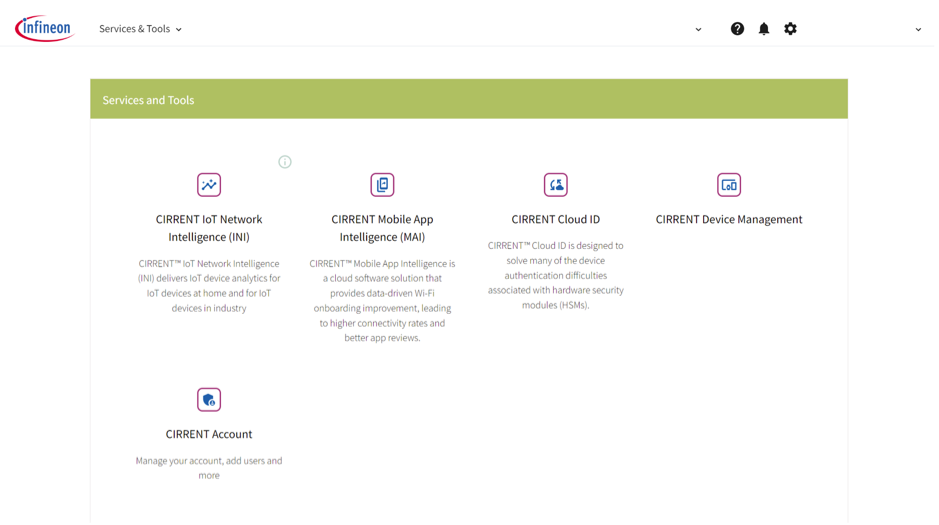
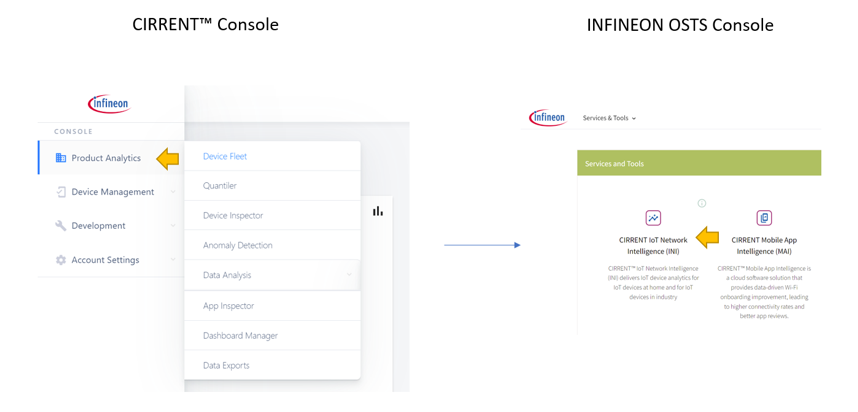
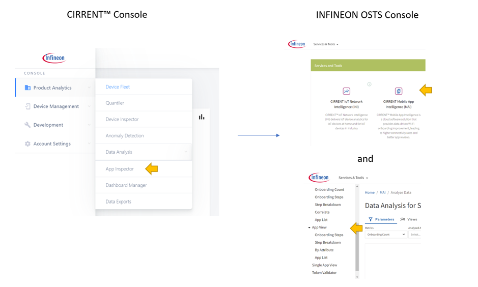
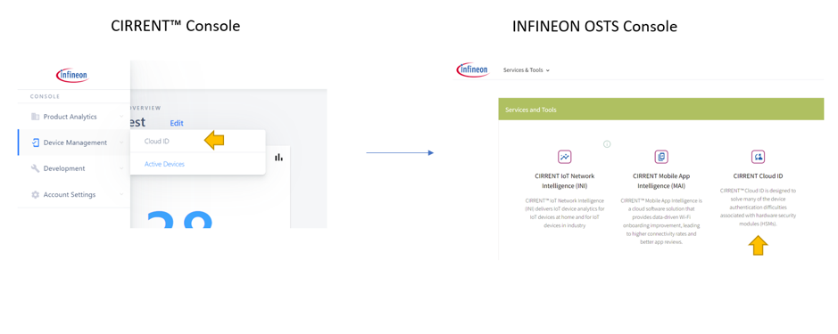

# CIRRENT™ Console is now INFINEON OSTS Console

We’ve now completed the process of switching all CIRRENT™ Console functionality to the INFINEON OSTS (Online Software, Tools and Services) Console. On this page, we’ll outline some of the changes you can expect.

The most significant change is that the console is now organized in a way that services are more clearly delineated according to the brand or product that the service belongs to. Key products including INI, MAI, and Cloud ID all enjoy a dedicated section with independent navigation trees for the services under these products.

> **_NOTE:_**  You will still use the same credentials to log in to INFINEON OSTS. Any other users authorized on your account can continue to use their existing credentials.

## Changes to the landing page

When you first log in to INFINEON OSTS you will notice that the landing page is no longer the CIRRENT™ dashboard. Instead, you’ll be directed to the new landing page for INFINEON OSTS (Online Services Tools and Software). On this landing page we organized the functionality previously found on CIRRENT™ Console according to product – with CIRRENT™ INI, CIRRENT™ MAI and CIRRENT™ Cloud ID now enjoying dedicated sections:

There are additional sections for functionality that are shared across the products: including **Device Management** to manage the devices reporting into your account, and a dedicated section for the management of your **CIRRENT™ Accounts**.

**A new way to access CIRRENT™ services – but you can still bookmark it**

When you use the new console you now access the CIRRENT™ service you need by first clicking on the CIRRENT™ product on the OSTS Console landing page, which will take you to the section for that CIRRENT™ service, e.g. CIRRENT™ INI.

Once in the relevant product’s section, you simply continue to select the service that you need. For example, for INI, the default view is your dashboard. You can then navigate to the Anomaly Detection page as per usual. You don’t need to navigate to the console home page to switch between products, simple use the navigator at the top left to switch.

You can still bookmark any commonly used services. For example, if you often view the INI dashboard just bookmark the page: [Infineon CIRRENT™ IoT Network Intelligence (INI)](https://osts.infineon.com/ini).  You can then navigate directly to the page by clicking on the bookmark in your browser. 

## Where to find commonly used services now

By dedicating a console section to each product, we aim to simplify finding the services related to that CIRRENT™ product. That does mean that some of your favorite services are now located in a different place.

### Product Analytics

Because most of the tools in the Product Analytics section were related to CIRRENT™ INI, many of the tools in the **Product Analytics** section has been migrated to a dedicated section for CIRRENT™ INI, accessible from the INFINEON OSTS Console – with the exception of **App Inspector** and **Exports**.

### Device Fleet page

We’ve also changed how the **Device Fleet** page works, it is no longer a single page with three tabs. Instead, the three tabs are located on dedicated pages:

* you’ll now find the visual analysis of device attributes under **CIRRENT™ INI** > **Data Analytics** > [Event Attribute Correlation](https://osts.infineon.com/ini/by-attribute)
* the device list is now available under **CIRRENT™ INI** > **Device Analytics** > [Device List](https://osts.infineon.com/ini/device-list)
* the Jobs list is located under **CIRRENT™ Device Management** > [Jobs](https://osts.infineon.com/device-management/jobs)

### CIRRENT™ MAI App Inspector

App Inspector used to be located under **Product Analytics** and **App Inspector**. That has now changed. You will now find the App Inspector views in the CIRRENT™ MAI section, under **App View**.
 

### CIRRENT™ Cloud ID

In the CIRRENT™ Console you used to navigate to **Device Management** > **Cloud ID** to access CIRRENT™ Cloud ID features. Now you can simply click on **CIRRENT™ Cloud ID** on the INFINEON OSTS landing page, [or navigate directly to this URL](https://osts.infineon.com/cloud-id), to access a dedicated section for Cloud ID.

Note that Cloud ID functionality is now no longer displayed on a tab-based view. Instead, we provide a dedicated navigation tree to make it simpler to access Cloud ID services.

### Other changes

* Device management capabilities now have a dedicated section in INFINEON OSTS, called Device Management – which covers a range of features, including providing a list of **Active Devices** and the **Log Explorer**.
* We’ve now consolidated all CIRRENT™ Account management features under a dedicated section which you can access from the OSTS Console landing page. That includes individual profile management as well as user management for your account.
* Data exports from your CIRRENT™ account are now located under the **CIRRENT™ Account** section.

