# CIRRENT™ Console for INI

The CIRRENT™ Console for INI is a central dashboard that helps you analyze how your fleet performs in aggregate, troubleshoot issues across your fleet, and to examine the performance and behavior of individual devices. You can read more about the CIRRENT™ Console itself and how to manage it here. 

To use the CIRRENT™ Console for INI you need:

* An active account on the CIRRENT™ Cloud
* A device with CIRRENT™ Agent installed on it
* A device that’s enrolled with CIRRENT™ Cloud

At this point, you’ve set up your device to be able to run CIRRENT™ IoT Network Intelligence (INI), and for you to review your device – or fleet – data 
To get started, just log in to https://cirrent.infineon.com/login with your CIRRENT™ Cloud credentials.

This guide is intended for engineers, product managers and customer support agents who use the console to get insights on their Wi-Fi connected products. This guide will walk you through how you can use the console to monitor performance of your fleet, to get insights at both the aggregate-level and on a single device, and to diagnose problems with products in the field.

## Dashboard

The first screen that you will see when you login is your INI dashboard. If you make use of multiple CIRRENT™ products you may need to toggle your dashboard using the hamburger menu, selecting your INI dashboard from the list of choices.

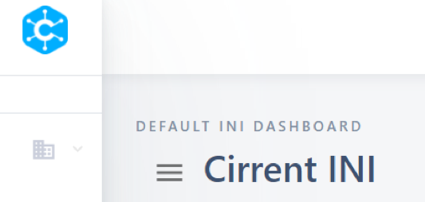

Towards the top of the INI dashboard you can choose the time period that you’d like to examine. Below, you’ll see several tiles containing INI-specific data and charts.

You can read specific values off the charts by doing a mouseover on the data point you’re looking to investigate. 
For a deeper dive into any of the charts, just click on the expansion icon   to view an expanded version of the chart, with each chart offering unique customization options.

### Default dashboard panels

This is how each panel relates to your IoT fleet:

* **Devices Reporting:** This chart shows number of devices that are reporting each day, across the indicated time period. 

  Expand the chart, and you can customize the chart to view devices reporting by CPU, by router brand or by any custom attribute you submit to the CIRRENT™ Cloud. You can also filter the devices displayed according to your choice of attributes – or filter group.

* **Problematic Routers:** This chart shows on which routers your products are most commonly experiencing the most issues, with ISPs sorted according to our network performance score metric.

  In the expanded chart you can adjust the chart to display results according to a different metric – DNS timeout, or low signal strength for example. You can also apply a filter group, and compare the chart according to a set benchmark.

* **Number of Devices Reporting:** This chart shows number of devices that have reported in the time period. Expand the chart to choose a filter group or add filters one by one to narrow down the counter to a select group of devices.

* **Population by router:** This chart shows the most common routers models your devices are attached to within the time period. Expand the chart to customize the number of slices shown, filter according to a filter group – or add filters one by one. You can also customize the chart to view any one of a range of custom attributes.

* **Population by ISP:** This chart shows a ranking of which Internet Service Providers most of your devices are on during the chosen time period.

* **Event types over time.** A chart that outlines the occurrence of specific event types as these occur over time, including DHCP and DNS issues as well as low signal strength and Wi-Fi interference.

  Expand the chart to customize which attributes are displayed, and to add specific filters or entire filter groups. You can also normalize the data for a standard deviation-based analysis of performance.

* **Recent Events.** This chart shows recent events occurring on any of your devices.

You can customize the CIRRENT™ Console for INI by adding custom charts to your dashboard. Just navigate to **Product Analytics** and **Dashboard Manager** to create new dashboards or to customize an existing dashboard.

## Device Fleet

The Device Fleet dashboard is where you can get an overview across your entire device fleet. It shows multiple tabs in a single tile, with fives tabs in total, each providing an aggregate view of your fleet. You can also check relative performance across different sub-sets of the fleet.

With this dashboard you have the ability to slice and dice the data by customizing the metrics displayed, choosing a filter group, or by adding individual filters. You can also customize the date range.

It allows you to see the performance of your device fleet including the top issues and errors that are reported by your devices. This data is helpful to help troubleshoot your products and provide the best experience for your users.

### Over Time

This tab shows key metrics over a time period. Toggling Normalize Data allows you to see the metric counts. You can filter by metric type (including network performance events and custom events). You can also filter by various attributes. For example, if you only want to look at your devices in the United States, you can filter by Country = US.

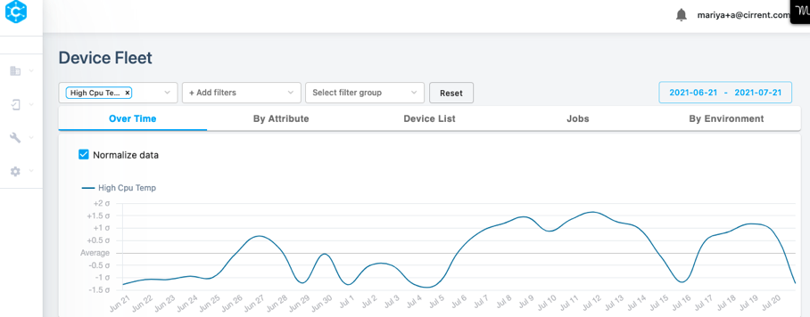
 
In this view, there are over 30+ prebuilt metrics, which can be leveraged to slice and dice the data and to filter for specific views. 
For complete full details on the exact meaning of metrics, and how these metrics are calculated, please view the INI Data Model page. The metrics you have access to include via the INI Console includes:

1.	WiFi Connected
2.	WiFi Disconnected
3.	App Crash
4.	Bssid Switch
5.	Days Since Last Connect
6.	Destination Service Unreachable
7.	Dhcp No Gateway
8.	Dhcp No Ip Address
9.	Dhcp No Netmask
10.	Dns Error
11.	Dns Timeout
12.	Gateway Error
13.	Gateway Internet Error
14.	High Cpu Usage
15.	High Memory Usage
16.	High Per
17.	Ip Conflict
18.	Low Signal Strength
19.	Low Storage
20.	Network Performance
21.	Offline Percentage 30 Days
22.	Offline Percentage 7 Days
23.	Powered On
24.	Restart Triggered
25.	Restarted
26.	Shutdown Triggered
27.	Tls Error
28.	Tls Expired
29.	Tls Hostname Mismatch
30.	Tls Not Yet Valid
31.	Wifi Associating
32.	Wifi Diassociated
33.	Wifi Disconnect
34.	Wifi Disconnected
35.	Wifi Failed Association
36.	Wifi Interference
37.	Wifi Not Associated
38.	Wifi Scan

All of these metrics can also be filtered by the following categories:

1.	City
2.	Country
3.	ASN
4.	CPU
5.	Device Type
6.	ISP
7.	OS
8.	Postal Code
9.	Region
10.	Router
11.	Router Brand
12.	Router Brand Model
13.	Wi-Fi Radio
14.	Wi-Fi Radio Driver

### By Attribute

This view shows a ranked view of metrics – including device attributes and events. You’re able to select a metric to view and filter by any attribute. You can customize which columns that appear in the attribute view.

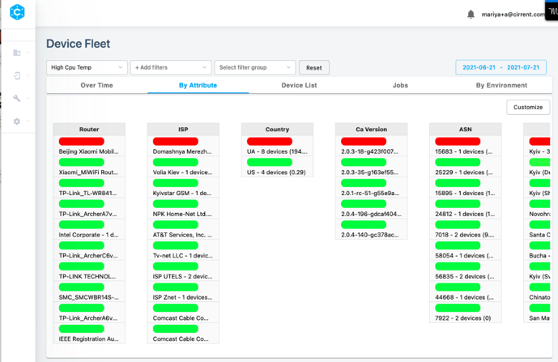
 
### Device List

This is a list of unique devices that have experienced the selected metric. In the screen below, Low Signal Strength is the metric. You’re also able to filter by any attribute, change the time period and customize the columns. The list defaults to a ranking from highest metric value to lowest.
 

### Jobs

The jobs tab allows you to manage CIRRENT™ Agent jobs across your entire device fleet. You can monitor jobs queued for action, and add jobs for future execution.
 
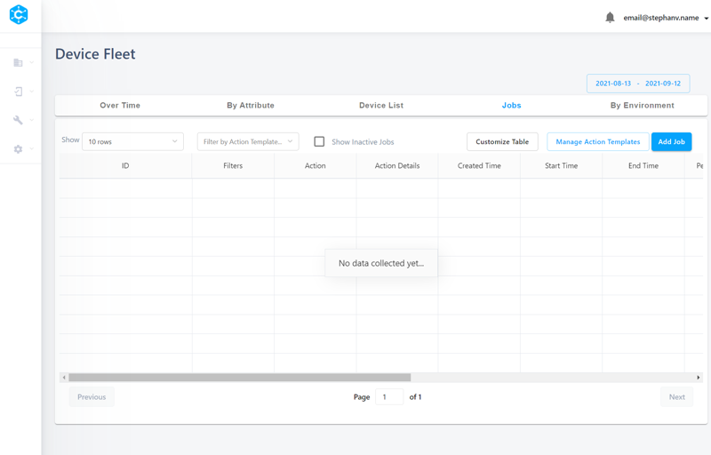

### By Environment

This is a benchmarking tool. To get the most out of the dashboard, click the settings button 

and choose what metric you’d like to view. Choose environment - from ISP, router, country or a combination of those. Then choose any attribute or attribute combination to compare against any other attribute or combination of attributes.

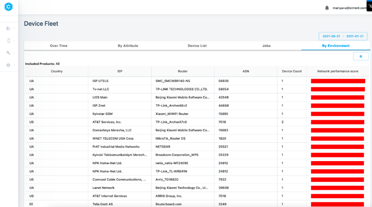
  
Once you apply the settings that you have chosen, the benchmark chart will populate. It will default to ranking from worst to best, but you can click on any of the columns and it will rank based on the column. For example, if you want to rank by number of devices in that environment, click “Device Count.”

## Device Inspector

The Device Inspector dashboards give you the view of a single device thanks to a device-level view. Your team can review the rich data on an individual device level to diagnose any particular issues with a device – or to achieve a deeper understanding of device behavior in the field. 

Device inspector covers data such as:

1.	Last Known State (Channel, Channel Width, Band, etc)
2.	Mesh Info (Single Node, Multiple Nodes, etc)
3.	Metrics Summary (10+ metrics)
4.	Measurements (Signal Strength, Wi-Fi Data Rate, etc)
5.	Wi-Fi Scans
6.	Diagnostics

### Network

This page shows the network performance of a single device. In the top right side, input the device ID and choose the time period to explore.

The **Last Known State** will show environmental information for the device including the network operator and the router make and model that the device is connected to. It will also show the SSID, BSSID, signal strength, frequency and channel width and a number of other data points – including custom data you collect via the CIRRENT™ Agent.

**Metrics Summary** table allows you to compare metrics for this single device against other devices in your fleet or a subset of the other devices in your fleet. Under the Last 30 days average, there is a dropdown menu where you can choose either from a list of attributes including device type, router, region, ISP, and more.

This is useful to understand if this device is performing better, worse or average compared to other like devices or devices in similar environments. For example, perhaps you’d like to compare this device against other devices with the same device type, or connected to the same router brand. This will help you nail down root cause of issues.

**Metrics Over Time** shows metrics for that particular device over the selected time period.
  

**Metrics** is a detailed breakdown of events for the device across the date range provided. You can customize the breakdown by selecting the events shown, and the date range.
 
**Measurements** shows the measurements collected by the CIRRENT™ Agent for the device.

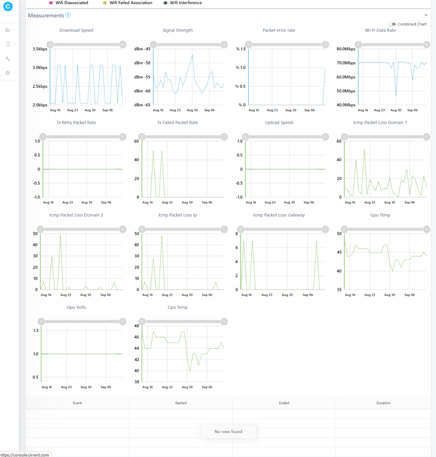

**Wi-Fi Scans** shows the list of Wi-Fi networks around the device. This is useful to check if there is an issue related to mesh extenders, or if there are too many networks on a particular Wi-Fi channel.

**Legacy diagnostics** will allow you to run legacy diagnostics on this particular device and view diagnostics that you have run as well as their status and results. Note that the legacy diagnostic feature has been deprecated, diagnostics should now be executed using the Jobs panel.

### Jobs

From this tab, you are able to run jobs such as diagnostics on a single device. You will see the status of the job on the chart table. Once the job has run, you will be able to click on the results to see more information.

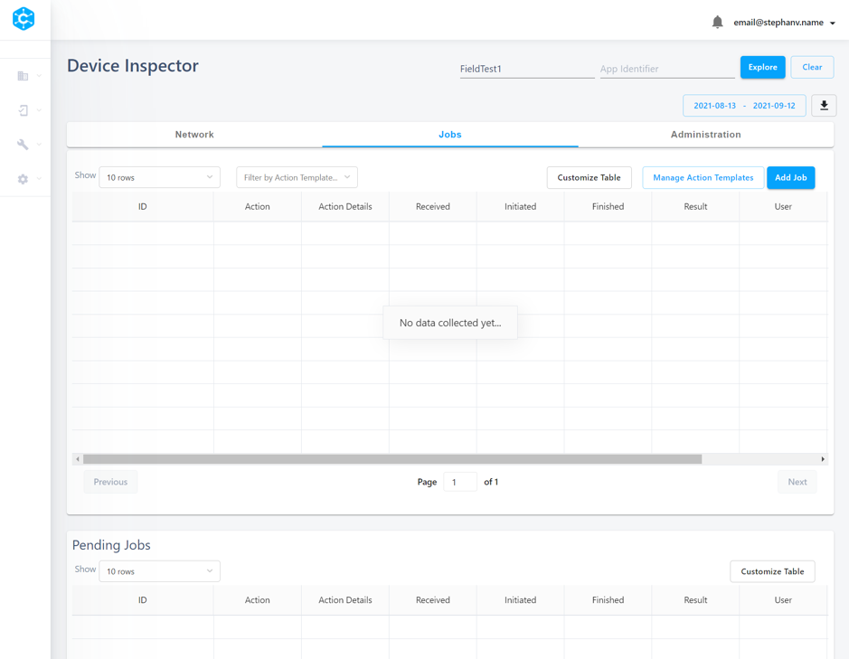

### Administration

This tab gives you further detailed information about the device. You can see which batch the device has been registered with, its registration date and the last active date.

You can also view a complete list of all attributes recorded for the device, including the last moment in time the attribute changed.

## Quantiler

You can get a sense of the overall performance of a group of devices by using the CIRRENT™ Console’s Quantiler to analyze the statistical performance of a specific measurement or event metric according to your attribute of choice, including dividing the values into quantiles to see how the values in a group are distributed. 

(The Quantiler view)
Quantiler splits the device data into a number of  separate data sets, with a distinct data set for each reported attribute value. It then separately analyzes the values for the measurement or event metric you selected within each of these data sets. In turn, you view a line by line analysis: each row represents an attribute value, and analyzes the measurements or event metrics collected for devices that report that attribute value.

For example, you can configure the Quantiler to analyze device upload speeds by the **country** in which the device is located. In this instance, the **country** is the attribute by which Quantiler creates data sets for analysis. You will see a data set for each country attribute value reported by your group of decies. The line by line view reports the following figures for each dataset:

* **Device Count:** The total number of devices counted in that data set, in other words the total number of devices that reported that attribute value.

* **Average:** The statistical mean for the measurement or event metric, calculated by adding all the values for all devices in the data set to generate the total, and dividing that total by the device count in the data set.

* **TP50:** The statistical median, the number of devices in the data set measuring below this value would be equal to the number of devices measuring above this value. Where the number of devices measured is odd, the median would be the middle value. Where the number of devices in the data set is even, the median number is the average of the two middle numbers.

* **TP5:** Represents the 5th percentile, in other words, the value indicated there is lower than 95% of other values within the data set.

* **TP95:** Represents the 95th percentile, the value which is greater than 95% of numbers within the data set.

.. note:: For TP5 and TP95, measurements with negative values should be viewed in the right context as the meaning of TP5 and TP95 switches around where negative values such as signal strength are evaluated.
 

### Configuring the Quantiler view
 
You can customize how you evaluate data in the Quantiler in a few ways. To start, set up the Quantiler by selecting two key aspects:

* **Select between viewing a measurement or viewing an event metric.** CIRRENT™ Console divides data variables into two groups: measurements, and event metrics. In the Quantiler, you can choose to analyze a variable from either group. Simply navigate to the **Measurement** or **Event** tab as shown below:
  
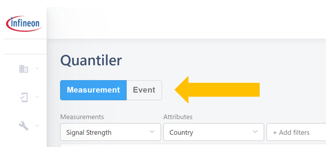

* Choose a variable to analyze. When you switch tabs, you’ll notice that the list of variables available to you changes. Measurement data is available on the **Measurement** tab, and event metrics are available on the **Event** tab. Use the variable box to choose the variable you’d like to analyze in the Quantiler, as shown below:

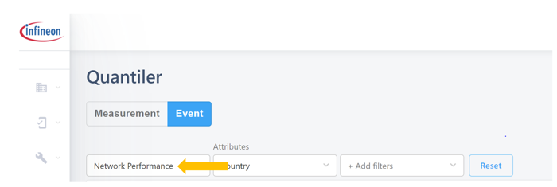

  All the standard CIRRENT™ variables are available to analyze, alongside any custom variables you configured.

> **_NOTE_** any filters applied persists across the **Measurement** and the **Events** tab. When you switch tabs, your filter configuration will remain in place. 

### Customizing the Quantiler view
 
The Quantiler helps you to drill down into your device data set by separating the data for your selected variable into a line-by-line analysis of the values for a specific attribute value. Each line in the table represents a unique data set, analyzing the data recorded for devices that match a specific attribute value. 

It’s therefore easy to analyze data by a factor such as the **Router** the device is connected to. This will render a line-by-line analysis with a line each for Cisco, Netgear, TP-Link, etc. In turn, the Cisco line will analyze the data set of measurements or event metrics generated by all devices connected to a Cisco router.

You can significantly customize the default view, a line-by-line analysis according to the country in which the device is located. To change this view, simply choose from the list of attributes as shown below and click **Apply**.
 
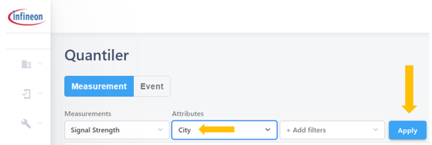

In the example below, we selected the line titled TP-Link represents a dataset of devices that are linked to a TP-Link router:
 
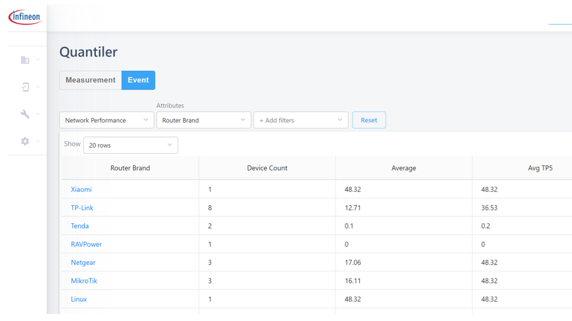

In the above example, network performance data sets for each router brand are analyzed individually – with individual counts, averages, and quintiles for every data set, listed line by line.

You can also choose to filter the values in the Quantiler by a specific attribute value. You can filter according to one attribute value or choose to filter across multiple attribute values. To add the first attribute value you want to filter against, first select the attribute from the list of available attributes:

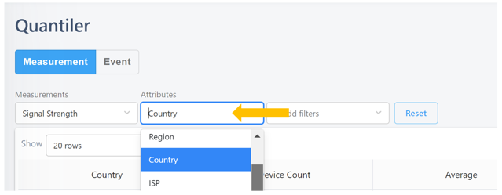

Next, select the filter you wish to apply to that attribute. For example, if you are searching by **Router Brand**, you will see a list of router manufacturers to choose from:
 
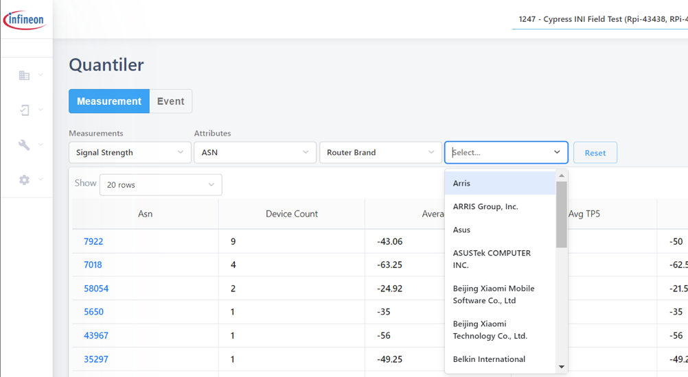

Simply click on a **Router Brand** attribute value to add a filter for that brand. You can expand the included router brands included in your filter by clicking on other router brands, adding additional brands until you’ve included all the devices you’d like to include in your filtered view.

You can further customize and expand the filter by choosing a different attribute to filter by and adding the selected value to the filter. For example, you could choose to look at devices connected to specific router brands which are in turn connected to specific ISPs.

.. note:: to clear the attribute filters one by one, simply click the [X] next to the field, as shown below. You can clear all attribute filters by clicking on the **Reset** button.

Finally, you can sort the values by any column, simply click on the heading title of that column. The first click sorts the values from lowest to highest. Click again to reverse the order from highest to lower. A third click removes the sorting selection.

In the above example we are sorting the view from highest to lowest according to **Device Count**.
 
### Exporting data from the Quantiler
 
Once you’ve configured your Quantiler view you can export the data in your view into a .csv file for further analyses in Excel or your tool of choice. Simply click on the Export button to the right of the Quantiler screen:

To view the exported data, navigate to **Product Analytics** and click on **Data Exports**. The latest exports will be visible, sorted by the time point at which the export was triggered.
 
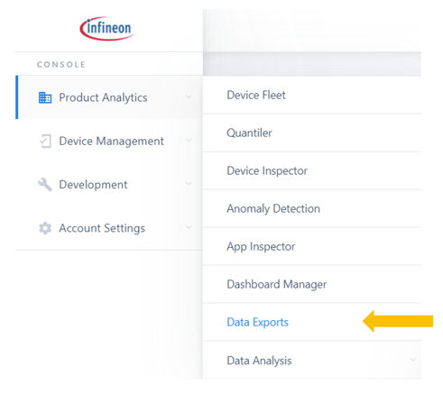

> **_NOTE_** when you export a view, CIRRENT™ Console exports the entire data set in that view – it does not break down data into data sets derived from attribute values. Instead, you receive all of the data in the view with each data item on a separate line.

## Anomaly Detection

You can use the CIRRENT™ Console’s **Anomaly Detection** page to evaluate anomalous device data at a glance. We currently support the analysis of **event metrics**. The Anomaly Detection page is split into two sections, displayed on two distinct tabs:
 
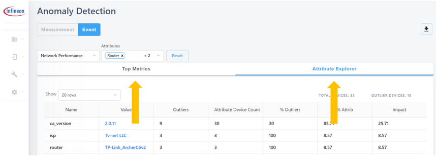

First, the **Top Metrics** tab displays a list of the event metrics with the highest proportion of devices reporting an anomalous reading. Next, the **Attribute Explorer** tab enables you to deep-dive into metrics based on specific attributes.

To access the Anomaly Detection page, simply navigate to **Product Analytics**, and click on **Anomaly Detection**.
 
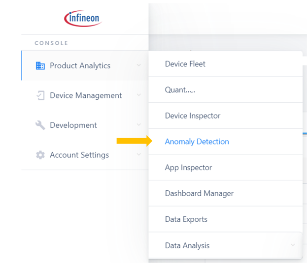

### Top Metrics

The **Top Metrics** tab displays a listing of the **event metrics** that are most associated with an anomalous reading. Currently, **Top Metrics** supports metrics based on event data only.  

 
For example, in the above image you’ll notice that in this sample population of devices, **wifi_interference** and **network_performance** were most commonly associated with an anomalous reading.

The **Top Metrics** tab lists metrics with the following fields:

* **Name.** Contains the name of the metric represented by that line.

* **Outliers.** A count of the number of devices that are reporting a value that qualifies as an outlier for that metric.

* **% total.** The percentage of devices reporting an outlier value for that metric, calculated by dividing the count of devices that reported anomalous readings for that event metric by the total number of devices reporting to the account. 

* **Avg TP5.** Represents the 5th percentile, in other words, the TP5 value is lower than 95% of other values for that metric.

* **Avg TP50.** The statistical median, the number of devices measuring below this value would be equal to the number of devices measuring above this value. Where the number of devices measured is odd, the median would be the middle value. Where the number of devices in the data set is even, the median number is the average of the two middle numbers.

* **Avg TP95.** Represents the 95th percentile, the value which is greater than 95% of values for that metric.

You can also view a **Total Devices** count, which represents the total number of devices reporting into your account, at the top right of the page:
 
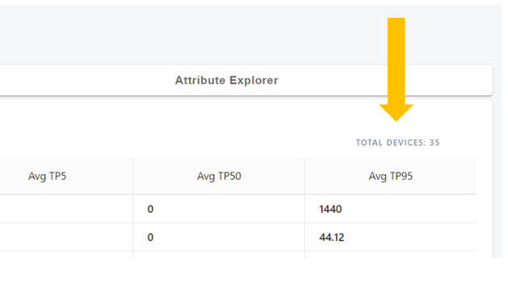

By default, the metrics are listed starting with the metric with the highest number of outlying values.
 
### Attribute Explorer
 
The Anomaly Detection page also allows you to explore anomalies for a specific event metric by breaking event metrics down according to the reported values for specific device attributes. You access this report on the **Attribute Explorer** tab.

Each line represents a specific attribute value. For example, you can determine which routers are creating high counts for network performance events by breaking down **network performance** events by router. In the example below, each line represents a specific router:

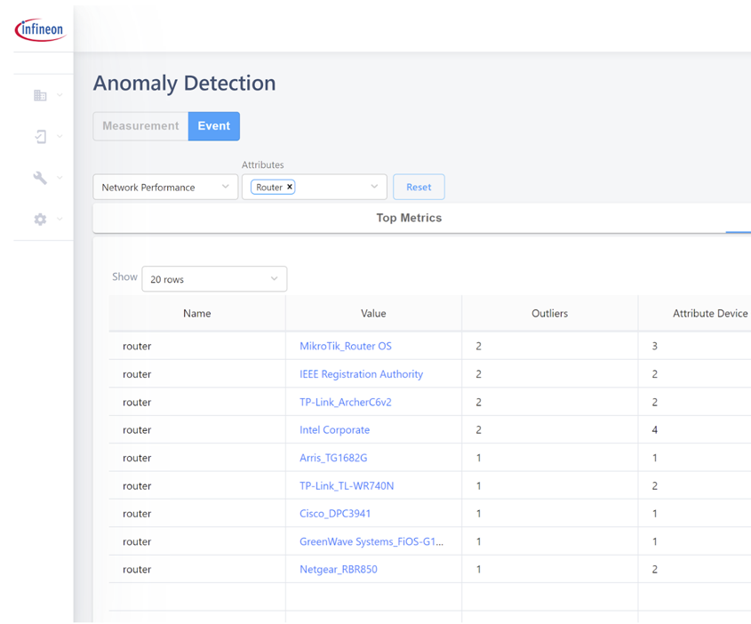

### Configuring the Attribute Explorer
 
Currently, the Attribute Explorer supports event metrics only. That includes any custom events you may have defined. Your first step in configuring the Attribute Explorer is selecting the event metric you would like to analyze:

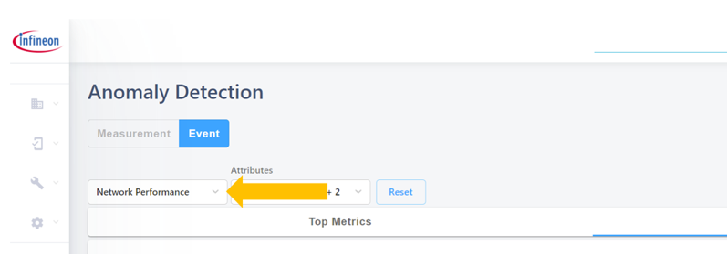

By selecting **Network Performance**, for example, you can review the outliers for network performance events according to your choice of attribute. As a next step you select the attribute you want to evaluate for outliers from the list of available attributes:

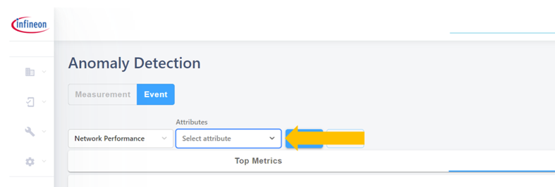

You can add multiple attributes to evaluate, simply continue to select attributes from the list of available attributes. For example, you could choose to review **Network Performance** outliers both by **Router Brand** and by **ISP:**

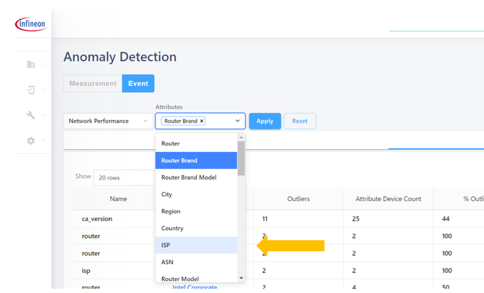

The resulting screen shows you a line-by-line analysis where each line represents a particular attribute, and a specific value for that attribute. Attribute Explorer will dedicate a line to every value logged for a particular attribute – but excluding any attribute value for which the outlier count is zero. 

In the example above, you’ll notice lines for **ISP** and for **Router** – because we’ve chosen to evaluate outliers for network performance events both by Router and by ISP. By default, the attribute value with the largest number of outliers is displayed at the top, with attribute values then listed in descending order of outlier count.

Every Attribute Explorer screen includes two counters. The total number of devices analyzed in the account, and the total number of devices in the account that reported an outlying reading for the metric you chose to evaluate:

For each attribute value, the following is displayed: 

* **Attribute device count:** number of devices that reported the specified value for that attribute.

* **Outliers:** number of devices that reported the specified value for that attribute and that also reported an outlier reading for the metric under evaluation.

* **% outliers:** for the devices reporting that attribute value, the percentage of devices that report an outlier reading.

* **% attrib:** for the attribute value in that row, the percentage of devices in the fleet that reported that specific attribute value.

* **Impact:** an impact score, calculated by multiplying the %outliers by %attrib. For example, if 50% of devices with that attribute value report outlier scores and if 25% of the devices being analyzed match that attribute, the impact score would be 0.50 x 0.25 x 100 = 12.5.

> **_NOTE_** When you change the metric you are evaluating CIRRENT™ Console will retain your attribute selections.

> **_NOTE_** To clear the attributes you are analyzing one by one, simply click the [X] next to the attribute, or click the down arrow and deselect attributes one by one – as shown below. You can clear all attribute filters by clicking on the **Reset** button, which restores the default attributes of **Router** and **ISP**.

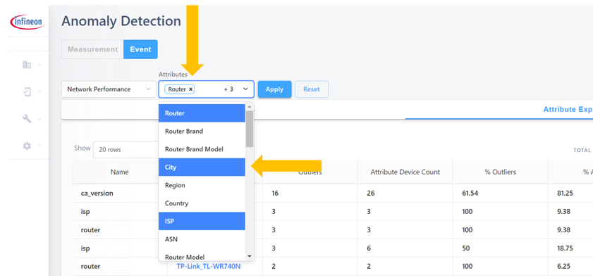

### Exporting data from the Anomaly Detector
 
Once you’ve configured a view you can export the data in your view into a .csv file for further analyses in Excel or your data package of choice. Simply click on the **Export button** to the right of the screen:

To view the exported data, navigate to **Product Analytics** and click on **Data Exportsv. The latest exports will be visible, sorted by the time point at which the export was triggered.
 

## Exporting data from the CIRRENT™ Cloud

The CIRRENT™ Console allows you to export data from the CIRRENT™ Cloud. 
You start the export process using the

   
button located next to the chart or table you are viewing. 

### Exporting chart data

All charts can be exported as images – either as an Adobe Acrobat PDF or a .PNG file. Alternatively, you can export the chart values displayed in a .CSV file. When you are exporting a chart your export action will trigger an immediate download in your browser.

### Exporting tables

You export table contents the same way you export chart data, but when you export a table your export will be generated by CIRRENT™ Cloud and made available under the **Data Exports** tab under **Product Analytics**.

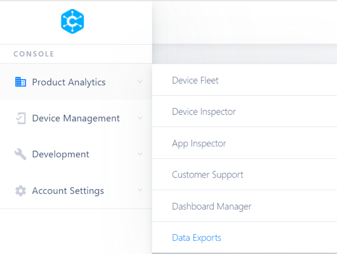