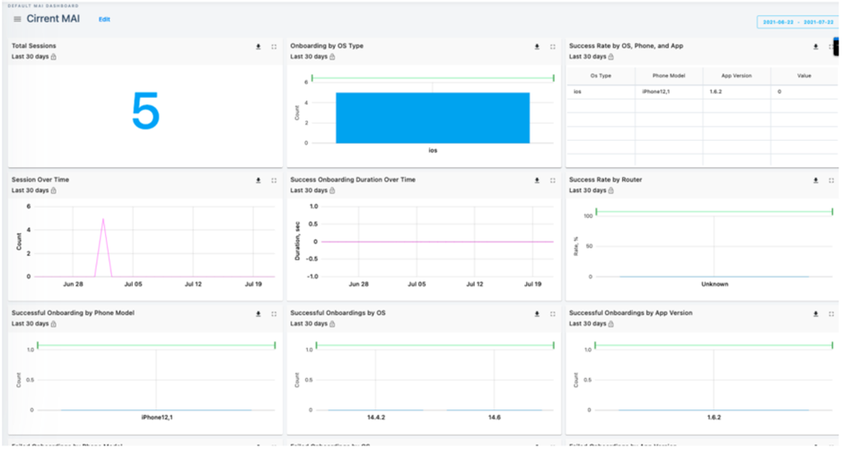
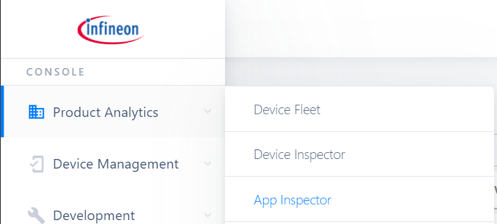
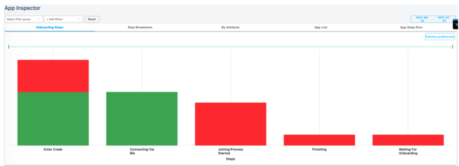
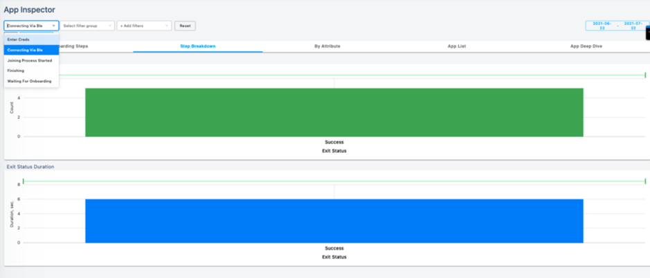
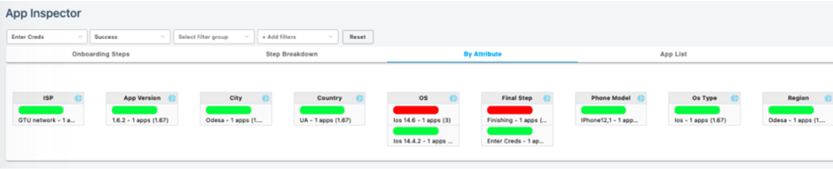
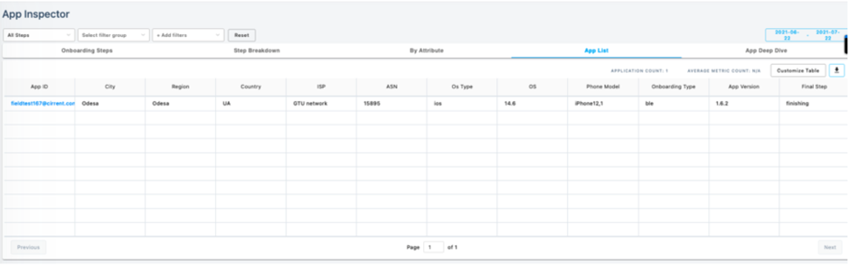
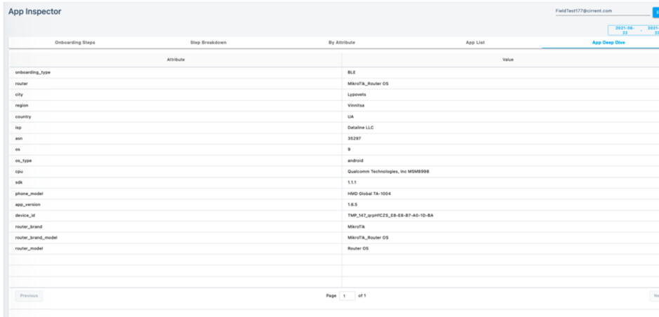

# CIRRENT™ Console for MAI

You interact with CIRRENT™ MAI via the CIRRENT™ Console. The CIRRENT™ Console contains a range of dashboards for MAI which are simple and easy to use. 

To access your CIRRENT™ MAI dashboards, simply log in to the CIRRENT™ Console and on the top right corner select the time period that you’d like to view. The dashboard will populate with data for that time period.

  
Starting at the top left corner, you will see a grid of tiles holding data and charts. For a deeper dive into any of the charts, just click on the expansion button  

within the box and it will take you to another page with more details.

## MAI App Inspector

You can take a closer look at your app analytics by using the MAI App Inspector. Access the App Inspector by navigating to **Product Analytics** and **App Inspector** on the CIRRENT™ Console navigation pane. Permissions to App Inspector requires the correct CIRRENT™ Console user privileges.

**Onboarding Steps**

The app inspector displays your customized onboarding steps and shows the success and failure rate at each step of the process. You can use this information to see how long it takes a user to go through the entire onboarding process, where the major bottlenecks are, and work with your team to create a smoother user onboarding experience.

**Step Breakdown**

Step breakdown allows you to filter by 6 pre-built onboarding steps as well as any custom steps created by your team. This tab under specifically lists the:

* Number of devices experiencing failures
* Duration of failures
* Exact failures experienced by your devices

**By Attribute**

An attribute is a characteristic or parameter of a device. In addition to the attributes listed below, you can add custom attributes that are specific to your products and customers like firmware version, radio driver, and more. If location is available for a device, it will be displayed in the map. The following attributes are included:

* **ISP:** Internet service provider that the device is connected to
* **Router:** Router that the device is connected to
* **City:** City where the device is located
* **Country:** Country where the device is located
* **Region:** Region where the device is located
* **OS:** Operating System
* **OS Type:** Android or iOS
* **Device Type ID:** Device type identification of the device
* **Add your own custom attributes:** MAI dashboard is flexible and can be personalized to the level of specificity of your choice.

**By App List**

The app list provides the ability to sort and analyze the performance of the app by any of the following attribute:

* **ISP:** Internet service provider that the device is connected to
* **Router:** Router that the device is connected to
* **City:** City where the device is located
* **Country:** Country where the device is located
* **Region:** Region where the device is located
* **OS:** Operating System
* **OS Type:** Android or iOS
* **Device Type ID:** Device type identification of the device
* **Add your own custom attributes:** MAI dashboard is flexible and can be personalized to the level of specificity of your choice.

**By App Deep Dive**

Dive deeper into each individual device to learn more about the exact onboarding steps, and the onboarding successes and failures for a specific user. Get access to tens and hundreds of data points for each individual device to understand the complete experience of each user.

  
