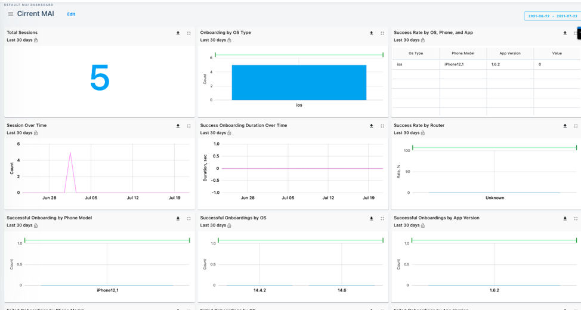
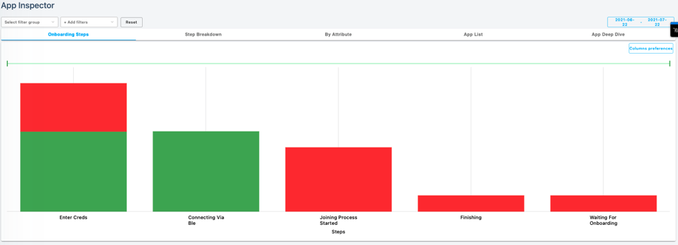
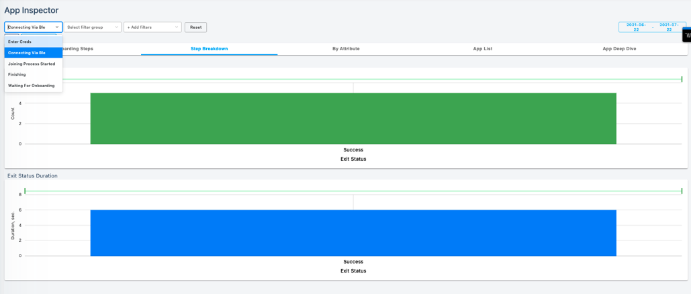

Using the MAI Dashboards
-----------------------------

Using CIRRENT™ MAI Dashboards is simple, easy and hassle-free. Below are the easy steps to get you started:

1.	Simply log in to the CIRRENT™ Console 
2.	On the top right corner select the the time period that you’d like to view
3.	Watch the dashboard on the home page repopulate with the appropriate data (example below)

 

On the top right, you can choose the time period that you’d like to view.

Then, starting at the top left corner, you will see various tiles holding data, charts,
etc. Below are descriptions of each tile and what they mean for your products.

For a deeper dive into any of the charts, just click on a point within the box and it will
take you to another page with more details.

On the left side of your screen, you will see the App  Inspector under Product Operations. Only Console  Users with Operations privilege have access to App  Inspector.  

## Onboarding Steps

The app inspector displays your customized onboarding steps and shows the success and  failure rate at each step of the process. You can use this information to see how long it  takes a user to go through the entire onboarding process, where are the major bottlenecks  and work with your team to create a smoother user onboarding experience.  

 

## Step Breakdown

Step breakdown has the ability to filter by 6 pre-built onboarding steps as well as any custom steps created by your team. This tab under specifically lists the :

* Number of devices experiencing failures  
* Duration of failures  
* Exact failures experienced by your devices

 
 

## By Attribute

An attribute is a characteristic or parameter of a device. In addition to the attributes listed  below, you can add custom attributes that are specific to your products and customers like  firmware version, radio driver, and more. If location is available for a device, it will be  displayed in the map.  The following attributes are included: 

* ISP: Internet service provider that the device is connected to  
* Router: Router that the device is connected to  
* City: City where the device is located  
* Country: Country where the device is located  
* Region: Region where the device is located  
* OS: Operating System  
* OS Type: Android or iOS 
* Device Type ID: Device type identification of the device  
* Add your own custom attributes: MAI dashboard is flexible and can be personalized to  the level of specificity of your choice.

 

## By App List

The app list provides the ability to sort and analyze the performance of the app by any of  the following attribute:  

* ISP: Internet service provider that the device is connected to  
* Router: Router that the device is connected to  
* City: City where the device is located  
* Country: Country where the device is located  
* Region: Region where the device is located  
* OS: Operating System  
* OS Type: Android or iOS 
* Device Type ID: Device type identification of the device  
* Add your own custom attributes: MAI dashboard is flexible and can be personalized to  the level of specificity of your choice.

 

## By App Deep Dive

Dive deeper into each individual device to learn more about the exact onboarding steps,  successes and failures for a specific user. Get access to tens and hundreds of data points  for each individual device to understand the complete experience of each user.

 
 

To learn more about the CIRRENT™ Console please review this [MAI User Guide](getting-started-with-mai.md).

